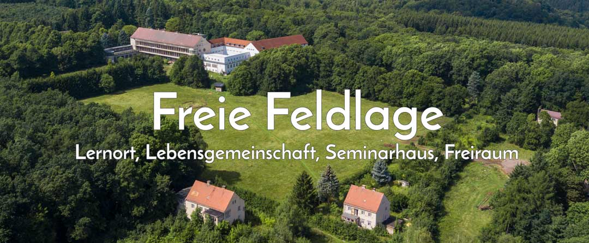
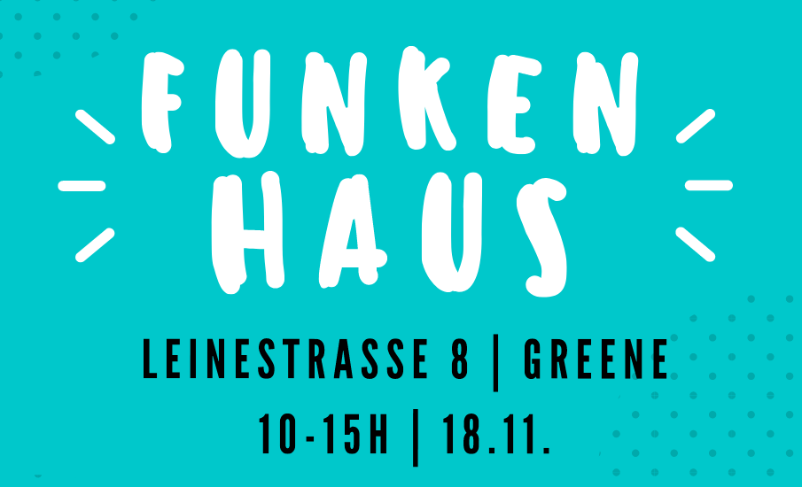
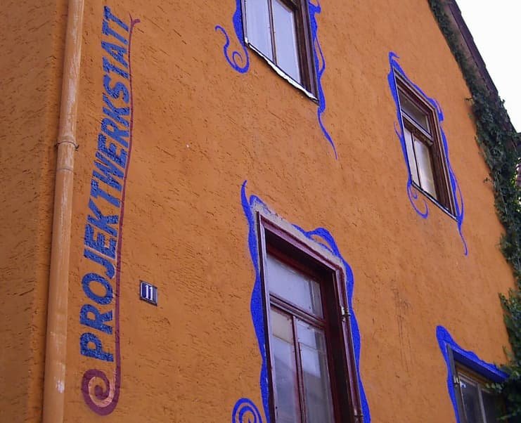
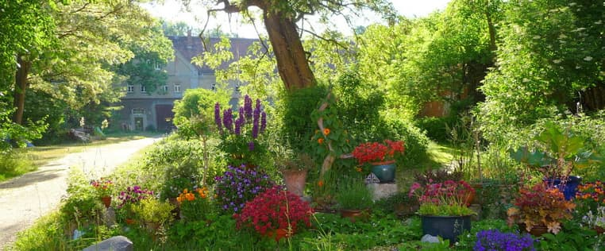
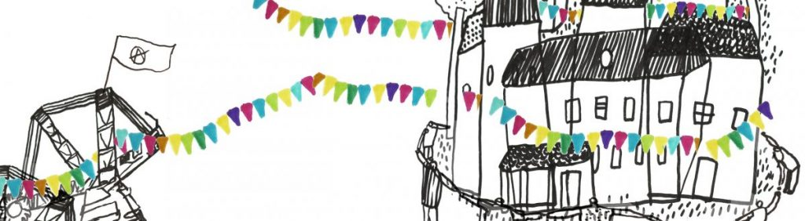

We have personal ties to the following projects which also share a lot - if not all - of our ideals: 
_Click the image to reach each projects website._

### Freie Feldlage in Harzgerode

The former children's clinic in the Harz mountains is a place full of opportunity. The huge area with its hospital buildings, forests and meadows offers as many tasks as it provides freedom. Many of us spent months there before Kanthaus even started and especially in summer it still is the place to be for those of us who prefer nature over city life.

---

### Funkenhaus in Greene

One year younger than Kanthaus but probably much more known Funkenhaus (formerly called 'Kollektivhaus') is like a sibling project to us. It emerged from the [living utopia](https://livingutopia.org) network which is a major player in the transformative scene of Germany. Our contact to this network goes back to [yunity](https://yunity.org) days for some and even further for others.

---

### Projektwerkstatt Saasen

"Come to Saasen, to Ludwigstr. 11. There stands Projektwerkstatt. It's the other world, the not normal, mostly money free and completely free of property. You would dive into the - hopeless - try to build the right thing into the wrong one. And even though this cannot work out, at least celebrate the clash with what's existing and get out the maximum of what is possible from this other world, which is oh so necessary."

---

### Lebenstraum Gemeinschaft Jahnishausen

Jahnishausen has been a home for people since decades. It is quite close to us in two ways: Just one day of cycling away and housing the dad of one of us.

---

### AAA Pödelwitz

Alternatives at the abyss: In Pödelwitz people are fighting for the end of coal mining, for saving the climate and for a just world for everybody.
