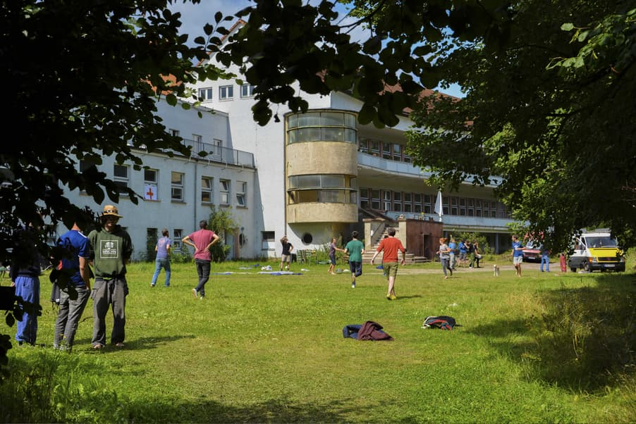

Die Gruppe, die die [undjetzt?!-Konferenz](http://www.undjetzt-konferenz.de/) letztes Jahr organisiert hat, kommt ins Kanthaus, um mit einer Retrospektive einen angemessenen Abschluss für diese Erfahrung zu finden.

===

Von Anfang an gab es enge Verbindungen zwischen der undjetzt?!, [dem Veranstaltungsort der letzjährigen Konferenz in Harzgerode](https://www.gemeinschaftsstifter.info/), den Menschen, die sich der Aufgabe gestellt haben das Event im Jahr 2017 auf die Beine zu stellen, und dem Kanthaus. Also freuen wir uns um so mehr sie jetzt bei ihrer Retrospektive unterstützen zu können! :D

_Ein kleiner Eindruck der undjetzt?! 2017 in Harzgerode._
