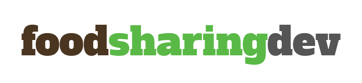

The next [foodsharing.de](https://foodsharing.de) hackweek is due!

The first week of July coders and coderettes are invited to gather at Kanthaus to have a great time with PHP and the foodsharing tech team! The refactoring will continue and the goal to make foodsharing.de a platform that is not only open source but also future-proof is still on. So come and join us to help us move into the right direction!

===

You only need to bring yourself, your laptop and whatever it is you can't live without. We provide spaces for working, sleeping, eating and socializing, saved food and drinks, a hot shower and even some clothes and toiletries if you prefer not to carry so much.

This is the schedule that awaits you:
* Friday, 29.6.: **Arrival**
  - presentation 'What does foodsharing generally mean?' in the evening
* Saturday, 30.6.: **Introduction**
  - discussion 'Strenghths and weaknesses of the online platform foodsharing.e' and clarifying the course of the week in the morning
  - presentation 'Programming for foodsharing.de - processes, tools and tasks' in the afternoon
  - afterwards room for Q&A and installation of a buddy system
* Sunday, 1.7.: **Work day**
  - free, collaborative programming with a short stand-up meeting in the morning
* Monday, 2.7.: **Work day**
  - free, collaborative programming with a short stand-up meeting in the morning
* Tuesday, 3.7.: **Work day**
  - free, collaborative programming with a short stand-up meeting in the morning
* Wednesday, 4.7.: **Half time**
  - reflection round 'What is the status? Is everything working as it should?' in the morning
  - cooking workshop for saved food 'Recipes are guidelines, not laws' in the afternoon
* Thursday, 5.7.: **Work day**
  - free, collaborative programming with a short stand-up meeting in the morning
* Friday, 6.7.: **Work day**
  - free, collaborative programming with a short stand-up meeting in the morning
* Saturday, 7.7.: **Work day**
  - free, collaborative programming with a short stand-up meeting in the morning
* Sunday, 8.7.: **Closing day**
  - retrospective discussion 'What did we achieve? How to continue from here?' in the morning
  - afterwards socializing and slowly saying goodbye until everybody leaves

Please [write us a mail](mailto:hello@kanthaus.online) if you'd like to participate. We're looking forward to having you!
