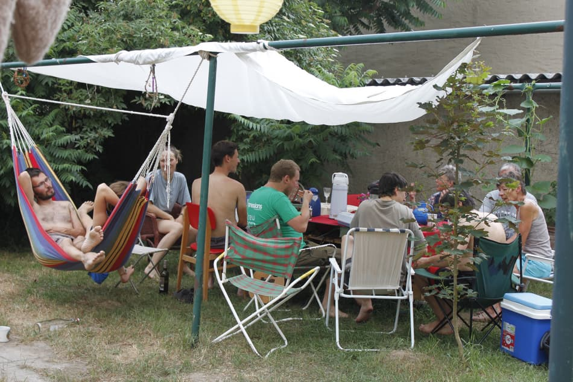

Kanthaus turns 1! And you're invited to celebrate this with us! :D

===

A lot has happened since we got the keys for Kantstraße 20 and 22 a year ago:
- We have electricity, heating and light in all of K20.
- We have a pretty stable core group of people shaping the place.
- We have more furniture and clothes than we can actually use...
- We have a lot of saved food, which we are glad to share.
- We are working on making our Food-Share Point and our Freeshop ready to be opened.
- We already hosted three hackweeks!
- We regularly host foodsharing brunches and repair cafes.
- We gained a lot of experience fiddling with solar power, [grey water](https://handbook.kanthaus.online/greywatersystem.html) and a [house bus](https://handbook.kanthaus.online/housebus.html).
- We built a garden with nice lawns, flowers and veggies.
- We built a cool homepage and do our best to keep it updated... ;)
- ...and much more!

If you still did not manage to come by, this is your chance! We can have some snacks and drinks together, stroll through the houses and just celebrate what we already achieved. Will you be there with us on this special day? :)
