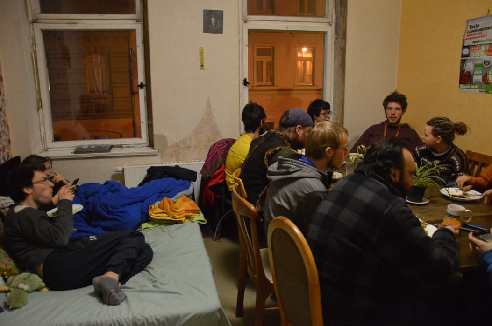

Our joint co-working weekend is approaching: From September 14 to 16 we'll see each other! Ten or more superregionally active people will come together in Kanthaus for some days to work on foodsharing.

===

Clara and Manu from the board of foodsharing took on the task to invite all the active foodsavers who are going to Berlin for the [foodsharing festival](http://www.foodsharing-festival.org/) to join an additional long weekend in Wurzen. The idea is the following:  
We create a close dialogue between different working groups, working group admins and the board. Together we can identify and treat problems, topics and wishes much better and we can meet each other in person. We'll get an overview of who actually does what in foodsharing and what an impact we already have!

Over the weekend we will meet with the whole group to decide who wants to target which question or issue, to then split up and do the actual work in a smaller group or alone. We will come together and split up dynamically, so that everyone can keep the overview while still being able to do self-directed work. This way we won't only get to know each other but can also already find out how we can improve our remote workflow: What do we need to have a functional communication and better decision making for the working groups and the board?

Everyone who is interested and has the time is warmly invited to stay for the week from the 17th to the 20th to then go to the foodsharing festival together.
