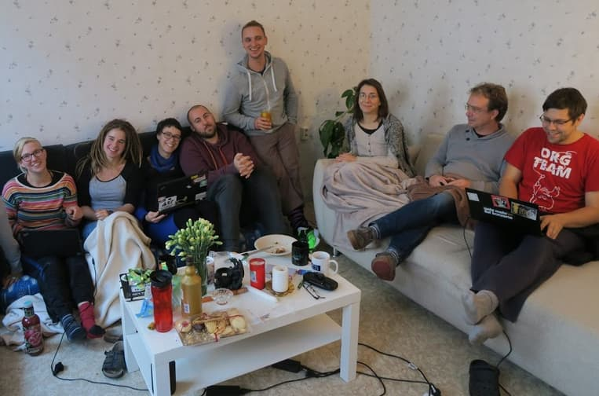

The season for _Foodsharing on festivals_ is over. This will be reviewed, celebrated and at the same time some planning for the next year will be done.

===

_Foodsharing on festivals_ informs about the foosharing initiative, hosts a food-share point on site and also actively saves a lot of food and resources from being watsed on the festivals. People who did foodsharing on commercial music festivals are meeting at Kanthaus for the second year in a row to adequately close the season.

 
_Last year's festival meeting was the first event Kanthaus ever hosted!_
