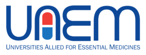
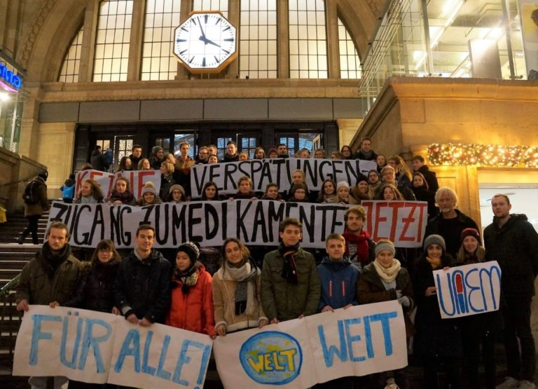

The [student group UAEM Leipzig](https://sturamed-leipzig.de/partner/uaem-leipzig/) meets at Kanthaus to plan their future actions.

===

The Universities Allied for Essential Medicines (short: UAEM) campaign for global access to medication. Especially publicly funded research plays a key part in this. That's why UAEM wants to figure out how universities can make a useful contribution: Fair return on public investment.

At this semester's vision meeting the following vital questions will be addressed:
- What do we want?
- How do we achieve our goals?
- What kind of structure do we need to function properly and pleasantly as a group?

 
_UAEM people at Leipzig main station in December 2017_

Kanthaus is happy to support this cause with infrastructure!
