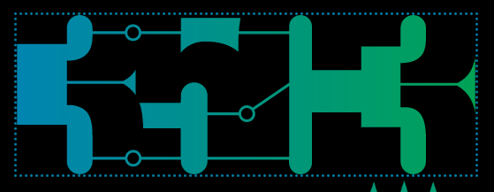

The biggest event of the European hacker scene is on and this time Kanthaus will participate on many levels!

===

On this year's [Chaos Communication Congress](https://en.wikipedia.org/wiki/Chaos_Communication_Congress) we will be present with–
- an official [talk about the foodsaving grassroots movement](https://fahrplan.events.ccc.de/congress/2018/Fahrplan/events/9882.html)
- a self-organized [talk about foodsharing.de development](https://events.ccc.de/congress/2018/wiki/index.php/Session:Foodsharing.de_call_for_web_developers)
- two self-organized [Acroyoga sessions](https://events.ccc.de/congress/2018/wiki/index.php/Session:AcroYoga)
- an [assembly for Kanthaus](https://signup.c3assemblies.de/assembly/64a868bc-3324-4cc8-9044-33f15c033218)
- an [assembly for foodsharing.de / Karrot / Foodsaving Worldwide](https://signup.c3assemblies.de/assembly/0092ac7e-f110-414c-b848-dd3954916166)

On top of that we might host more or less spontaneous foodsharing.de networking meetups, foodsaving and distribution actions and much more! If you're at congress, too, please stop by our assemblies and say hi! :D
