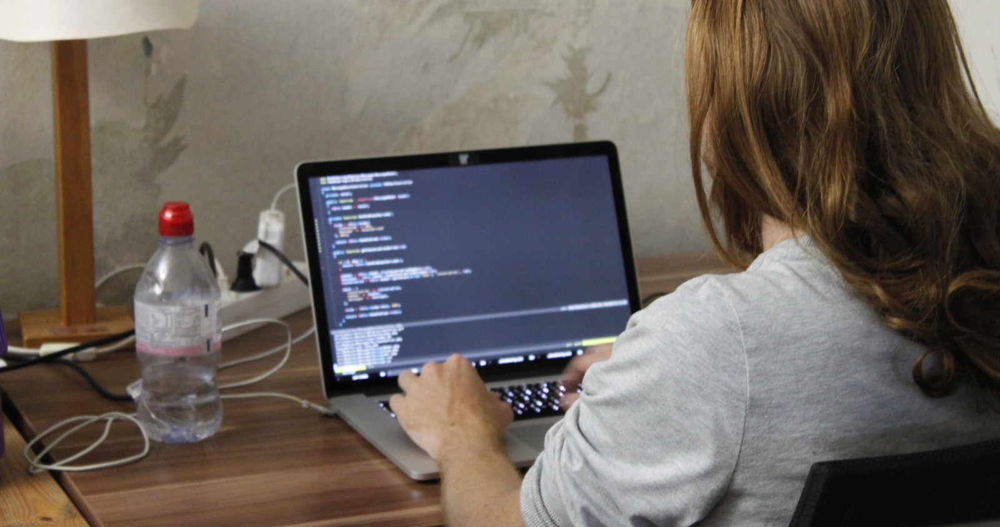

Die nächste [foodsharing.de](https://foodsharing.de) Hackweek steht an!

Ab Mitte Februar laden wir zum fröhlich-produktiven gemeinsamen Coden ins Kanthaus und hoffen, dass möglichst viele der neuen und alten Mitglieder des foodsharing-dev-teams sich bei uns einfinden. Das Refactoring wird weitergehen und das Ziel foodsharing.de nicht nur Open Source sondern auch zukunftssicher zu machen ist inzwischen am Horizont erkennbar. Also kommt vorbei und helft uns dabei das Licht am Ende des Tunnels heller werden zu lassen!

===

Mitbringen musst du nur dich selbst, deinen Laptop und die Dinge, ohne die du wirklich nicht leben kannst. Wir stellen Räume zum Arbeiten, Schlafen, Essen und Schnacken, gerettetes Essen und Trinken, eine warme Dusche und sogar Sachen zum Anziehen und Drogerieartikel, falls du lieber mit leichtem Gepäck reist.

Das erste Wochenende wird als Einleitung, zum Kennenlernen und Aufgaben verteilen bzw. Arbeitsgruppen bilden dienen. Die Woche über wird vor Allem viel selbstorganisiert programmiert und sich dynamisch in kleine Meetings oder Pair-Programming Grüppchen zusammengefunden. Den Abschluss bildet das zweite Wochenende dann mit Gesprächen über die Zukunft, was foodsharing ist und sein könnte und wie wir - nicht nur an der Software-Front - dahin kommen können.

Bitte [schreib uns eine Mail](mailto:hello@kanthaus.online), wenn du dabei sein möchtest. Wir freuen uns darauf, dich begrüßen zu dürfen! :)
