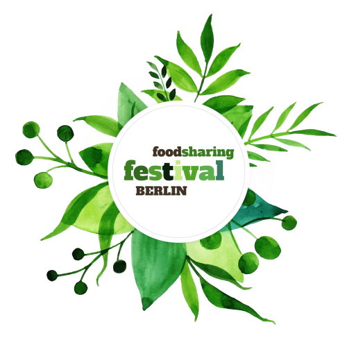

The foodsharing festival is about raising awareness for the topic of food waste, about bringing together foodsavers from all different corners of Germany and beyond and about encouraging people to take part in living change.

It will take place in Berlin from August 16 to 18 and we are happy to support the process of making it happen!

===

This year we chose the slogan 'living change' for the foodsharing festival. We will meet again at Malzfabrik in Berlin and look into changed consumer habits and alternatives together.

Between August 16 and 18 there will be around 600 people meeting every day to engage in workshops, seminars cooking sessions, info stands, music, yoga and much more - all in the name of living change, fighting food waste and making the world a better place for everybody, and all free of charge.

The team that has been working tirelessly for months to make the festival happen consists of volunteers only and all the money needed for an event at this scale was donated.

We invite whoever is interested to come by and take part, be it a foodsharing veteran or complete newbie! All visitors get the chance to exchange ideas, network between each other and spend an amazing weekend together. Everybody is welcome!

If you want to support the event financially you can do so via the [crowdfunding campaign](https://www.betterplace.org/de/projects/70593-foodsharing-festival-2019).
