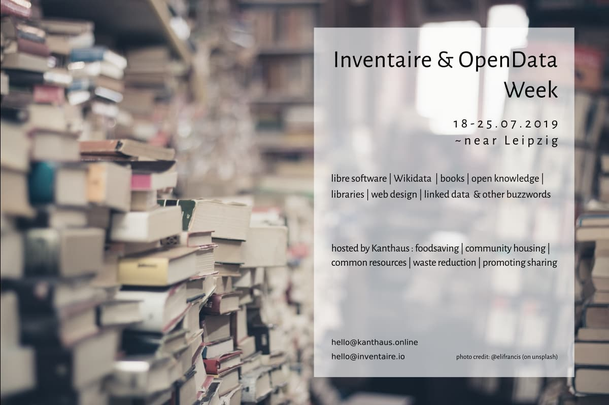

[Inventaire](https://inventaire.io) - das freie Softwareprojekt, das dich deine persönliche Bibliothek verwalten und mit deinen Freunden teilen lässt - wird für eine Woche im Kanthaus sein, und sie wollen, dass _du_ sie bei ihren Bemühungen unterstützt!

Alle, die Inventaire nutzen oder sich dafür interessieren - sei es für die Daten, den Code, das Design, die Kommunikation - sind eingeladen an dieser Woche des Lernens, Teilens und Mitmachens teilzunehmen!

===

[Lies die englischsprachige Einladung des Inventaire-Teams](https://wiki.inventaire.io/wiki/Inventaire-OpenData-Week-2019?lang=en) für alle Infos, die du brauchst.
