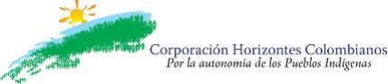

Caroline Schiller, die gerade erst ein Jahr in Kolumbien verbrachte, um mit Indigenen zu arbeiten, erzählt von ihren Erfahrungen und Erkenntnissen. Ihr Bericht bezieht sich auf die NGO [Corporación Horizontes Colombianos](https://horizontes.xyz/en/) (CHC). Nach der Präsentation gibt es Zeit für Fragen und Austausch. Der Vortrag findet in englischer Sprache statt.

===

Die Presentation zeigt, welche Ziele CHC verfolgt, was für Projekte bereits zur Unterstützung der indigenen Bevölkerung durchgeführt werden und wie auch du helfen kannst. Es wird ein Überblick über die gefährliche Situation gegeben, in der sich Indigene befinden - vor allem, wenn sie anfangen sich für ihre Rechte einzusetzen.
