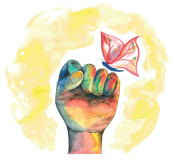
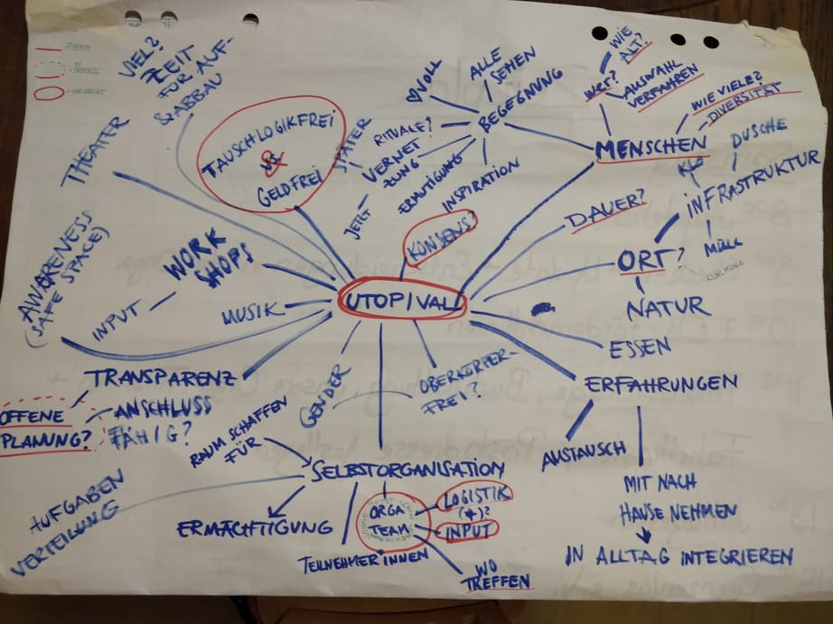

Next year's [utopival](https://www.utopival.de/) is starting to get planned! The orga team meets at Kanthaus to make up their minds and come up with dreams, ideas, wishes and thoughts for the next uptopian festival where people can already experience how life can be when everything works according to needs and skills instead of coercion and exchange.

===

The alternative name for utopival is 'the world's most amazing utopian participatory space', meaning that it is a space in which people can already live the life they dream of for everybody, even though the surrounding world is not there yet. The goal of utopival is to let people experience the utopian freedom that is possible when they come together as authentic, open and loving individuals to form a community that takes care of each other. It is a time to share, to learn, to be inspired and to inspire others, but also a time to be vulnerable, to heal and to regenerate.

No utopival works without its participants - the people taking part are the ones shaping it. The orga team prepares the location and defines the frame, but the festival itself is run by the people on site. There will be as little hierarchy as possible, no drugs, no exchange logic, no exploitation or oppression of any kind and thus only tasty vegan food, conscious people, unconditional sharing and equity between people.

By getting involved early in the process you can contribute to making this event become as fantastic as your dreams!

