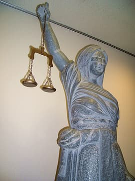

Learn to use the law for your purpose, instead of being at the mercy of it: Ways to use in court that deal with repression.

===

What does repression do to us? What is criminal law, what is the right of assembly, what is a claim for damages and how do all of these interact? How does a court trial go? How can it be led to benefit political agendas? How can we counter the helplessness and instead define what is happening in court?

The three day workshop introduces to the idea of self defense / defense of each other in court. We do role plays, talk through court cases and train very practical possibilities to counter repression in criminal law suits.
