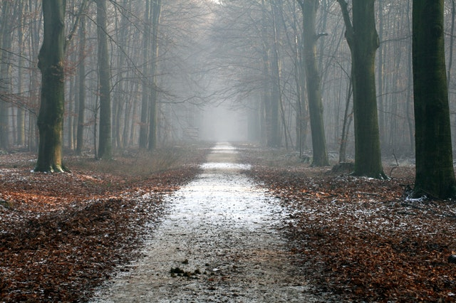

We take the time to close down, introspect and refocus. 
No new visitors are accepted during the month of introspection.

===

The idea is to have a period of time where no-one in Kanthaus has to spend time hosting people or acclimatizing to new social dynamics. Hopefully check-ins/evaluations can be reduced in frequency too. With this increased stability, people may find it easier to reflect/plan/do project work. Last year's experience showed that we really need and like this time of introspection.

Having it in winter has a seasonal relevance, since it is the time where all of nature slows down and recharges for next summer. We want to take part in this dynamics and maintain the organism that is Kanthaus. Thank you for your understanding.
