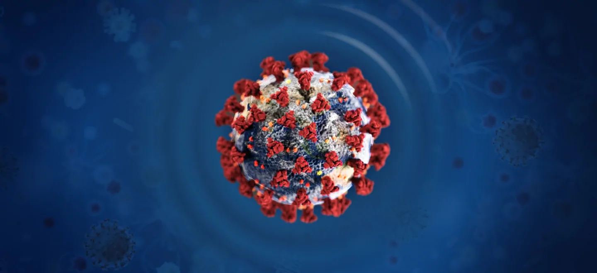

Wir haben uns als Kanthaus-Gemeinschaft dazu entschieden unsere soziale Verantwortung wahrzunehmen und zur Verlangsamung der Ausbreitung des Coronavirus beitragen zu wollen.

Als junge, gesunde Menschen gehören wir zwar nicht zur Risikogruppe, können uns aber natürlich trotzdem anstecken und das Virus auf andere übertragen. Das kann auch schon passieren, wenn man selbst keine Symptome hat.

Daher vermeiden wir vorerst soziale Kontakte und Veranstaltungen und raten dies auch anderen Menschen. Nicht nur aus Sorge um uns selbst, sondern vor allem, um ältere und vorerkrankte Menschen zu schützen. Das Hauptaugenmerk muss darauf liegen Belastungsspitzen im Gesundheitssystem zu vermeiden, und wir wollen Teil der Lösung sein und nicht Teil des Problems.

Der Offene Dienstag, der foodsharing Brunch, die Bauwoche und alle anderen Veranstaltungen sind deshalb erstmal abgesagt bis sich die Lage beruhigt hat.

===
