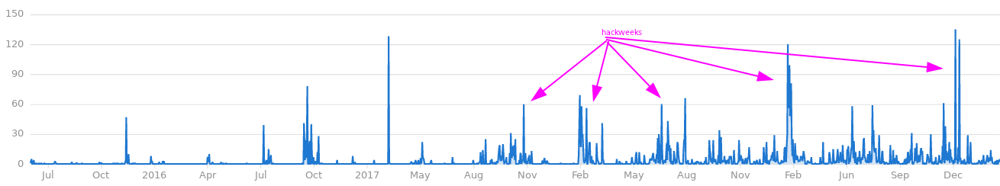
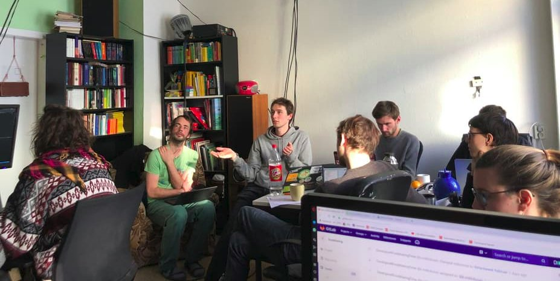
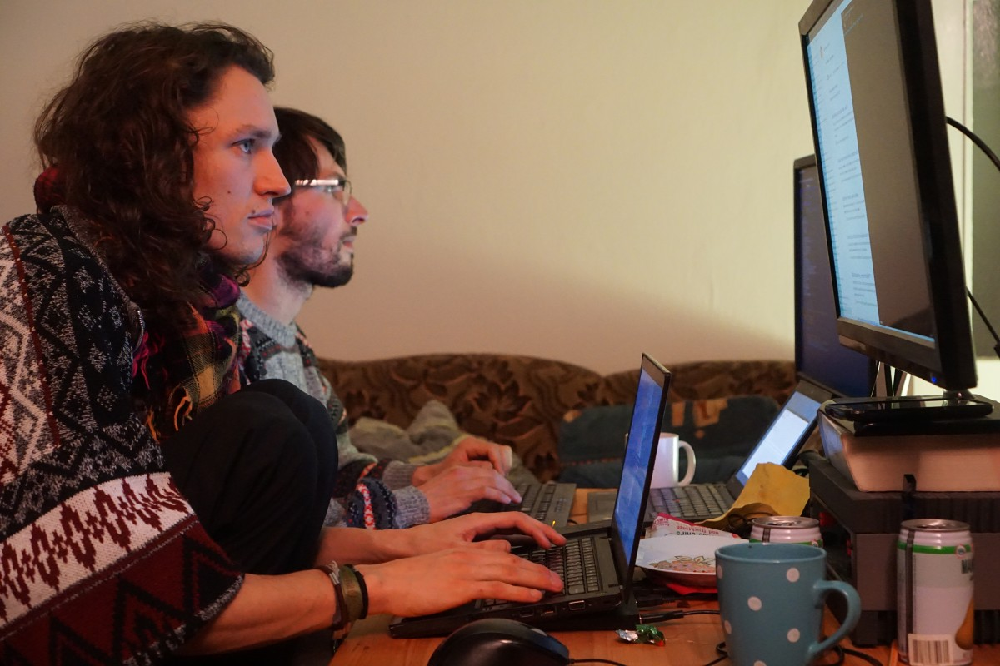

**AKTUALISIERUNG: Die Hackweek ist vorerst ist abgesagt. Wir wollen mithelfen, die Verbreitung des Corona-Virus zu verlangsamen. Das beste Mittel hierfür scheint zu sein, soziale Kontakte in den nächsten Wochen einzuschränken.**

**Wir überlegen gerade, wie eine Online-Variante des Events aussehen könnte.**

---

Es ist Zeit für die nächste foodsharing Hackweek!

Hackweeks sind der Motor im foodsharing development: In den Hackweeks, die wir über die letzten Jahre hatten, haben wir es geschafft foodsharing Open Source zu machen, Sicherheitslücken zu schließen, neue Features zu implementieren, coole neue Frameworks einzubauen, und mehr. Im Devblog kannst du lesen, wie [die allererste Hackweek](https://devblog.foodsharing.de/2018/03/06/february-hackweek.html) vor beinahe zwei Jahren ablief, und [eine weitere](https://devblog.foodsharing.de/2018/07/16/summer-hackweek.html) später im selben Jahr.

===

Und hier ist der Anstieg an Commits deutlich zu erkennen:

(Nunja, Hackweeks und andere Programmiertreffen...)

Es ist außerdem toll mal zusammenzukommen! An foodsharing zu arbeiten ist meistens eine recht einsame Angelegenheit, aber gemeinsam am selben Ort zu sein, hilft dabei ein Teamgefühl zu entwickeln und einander zu unterstützen.

Ich zum Beispiel, liebe es mich ganz in grün anzuziehen und Leuten Sachen zu erklären, wie du hier sehen kannst:

Diese Veranstaltung ist ganz anders, also die bekannten Koffein-schwangeren Hackathons, wo man die ganze Nacht durcharbeitet. Wir haben _eine ganze Woche_ und wir nehmen uns die Zeit zusammen zu kochen, leckeres Essen zu essen, kleine Ausflüge zB zum See zu machen, zusammen Musik zu machen, sich über Gott und die Welt zu untrhalten, usw. usf...

... falls du allerdings lieber den ganzen Tag vorm Bildschirm hockst, wie Chandi und Matthias unten, dann ist das auch cool. :sunglasses:

Was noch _mega wichtig_ ist, ist dass **Hackweeks nicht nur für Programmierer und Nerds** sind, sondern dass es soooo viele Themen gibt, über die es zu diskutieren gilt! Und wir wünschen uns mehr Kommunikation zwischen den Entwicklern und der Community von foodsharing.

Du könntest auch kommen und den produktiven Vibe nutzen, um an einem anderen foodsharing Projekt zu arbeiten. Wir fänden das super!

### Einige grundlegende Details

**Wann** - 25. April bis 3. Mai 2020
**Wo** - Kanthaus in Wurzen, bei Leipzig, (auf https://kanthaus.online/contact findest du die Adresse und wie du hinkommst)
**Schlafen** - Im Kanthaus gibt es Platz für bis zu 20 Gäste, trag dich ins Pad unten ein
**Essen** - Es geht um foodsharing, also wird es viel Essen geben ... aber vielleicht kannst du ja dabei helfen das zu organisieren. Falls dem so ist, schreibs ins Pad

### Klingt super, ich bin dabei!

Diesmal wird alles _selbstorganisiert_ ablaufen, deshalb findest du hier ein Pad, das wir alle zusammen mit Inhalten füllen. Trag dich gern mit ein: https://codi.kanthaus.online/foodsharing-hackweek?edit

Ein weiterer Kommunikationskanal ist der #foodsharing-hackweek Channel auf https://slackin.yunity.org/ - also komm gern auch dort hin!

Diese Veranstaltung kann ohne deine Hilfe nicht stattfinden, also bring dich bitte im ganzen Prozess mit ein.

Ich freu mich drauf euch alle zu sehen! :heart:

_schreibt Nick_
