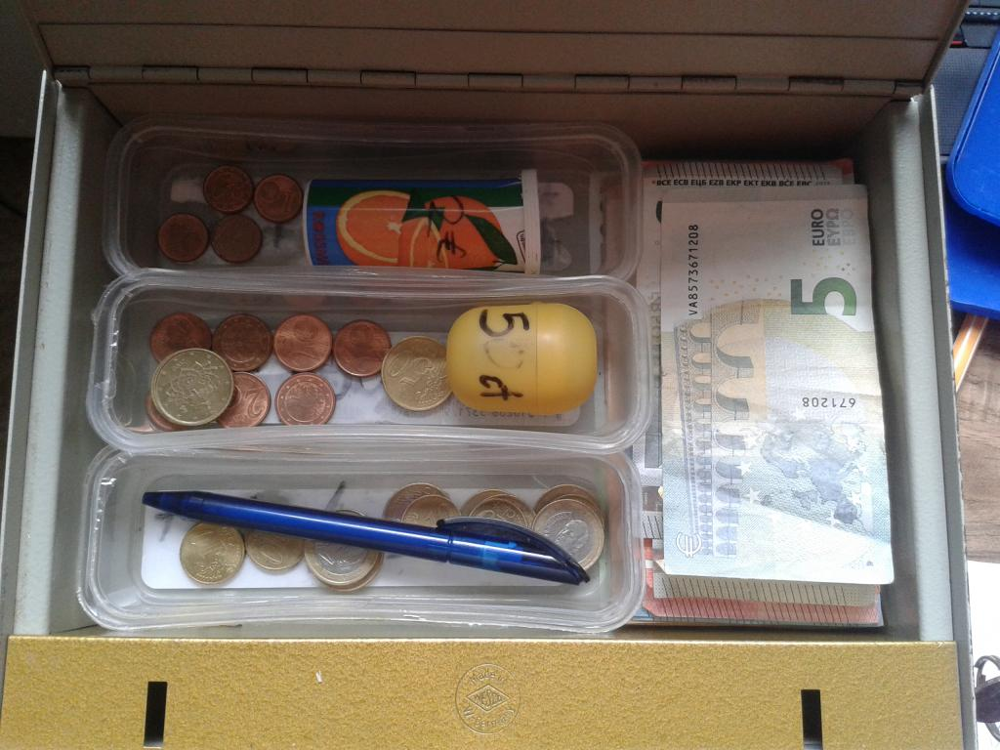
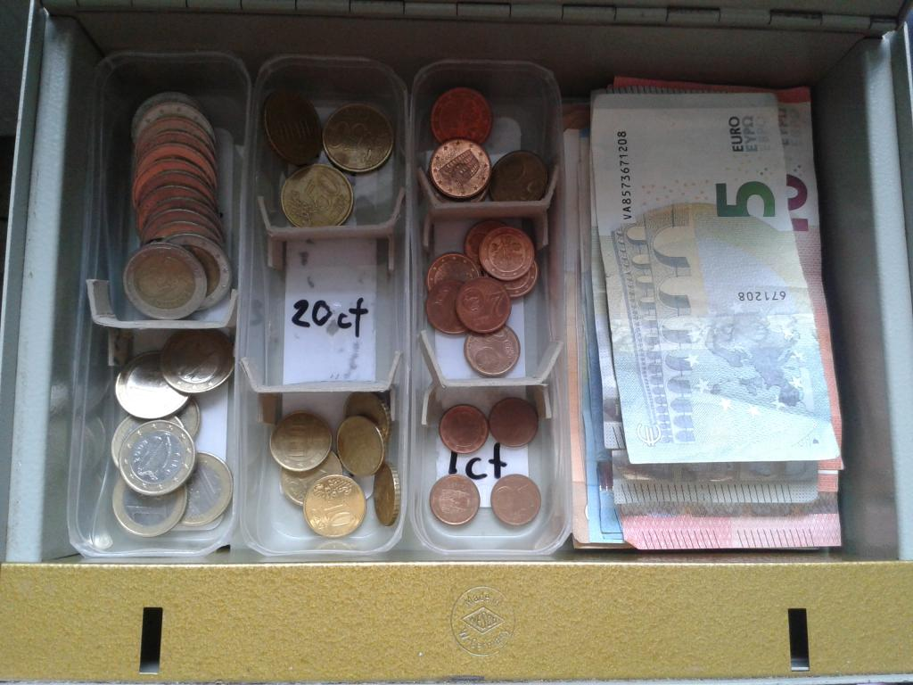
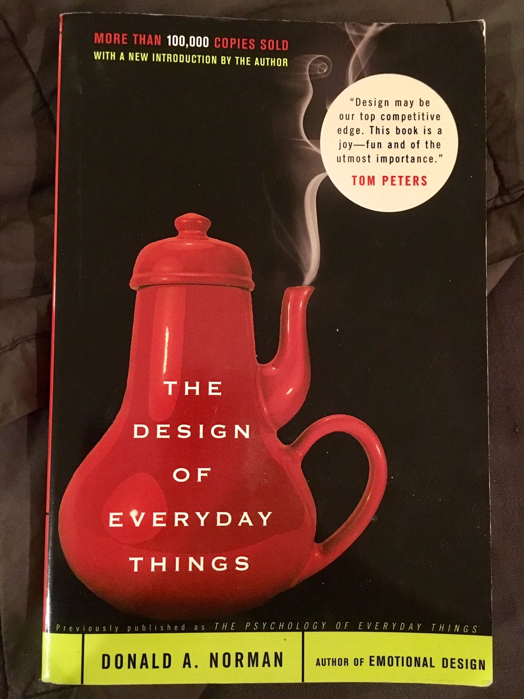

### A case study of the importance of simplification

**Summary:** I redesigned a cash box to make it easier to use. Designing systems to be easy to use is important if you want other people to use them (in the way you intended.)

===

Today I was transferring money from the Kanthaus donation container (mixed cash) to a cash box (sorted cash.) Before today I’d only added notes, but this time I had three coins to add: a 50ct, 10ct and a 1ct. Sorting the coins in correctly wasn't so easy to do. The cash box looked like this:

Here the coins were separated into three mixed boxes (one for €1 and 10ct, one for 50ct and 2ct, one for 20ct and 1 ct) and two containers (one for €2 and the other for 5ct.) On each container the bottom of each box was written the (mixture of) coins they should contain. Described this way, it might not seem so bad, but actually this system was quite difficult to use:

- the writing on the bottom of the boxes is covered by coins, and since you can’t read what is meant to be in the boxes, the mixtures look random,
- even when you figure out the order, it doesn't seem to follow any predictable pattern meaning that the place of each coin has to be learned independently,
- the €2 and 5ct coins are in containers and can’t be directly seen, meaning that two types of visual cue are required to locate where a coin should go (i.e. image of coin vs. label,)
- the €2 and 5ct containers must be opened, meaning two types of physical action are required to place coins (i.e. dropping into place vs. opening and adding,)
- there’s not enough space to freely add/remove bigger bank notes, meaning that the coin boxes must be moved.

The reason that user-unfriendly systems are a problem can be more clearly understood by considering the options I was faced with:

1. **learn the system** with all its current complexity (consuming unnecessary time from me and future users,)
1. **break the system** by throwing the coins in randomly (wasting the time of the users who learned the current system,)
1. **avoid the system** by giving up on the task (leading to a centralization of work on fewer users,)
1. **re-design the system** to be more intuitive (for new users and old.)

I chose the last option:

I trimmed the boxes, added cardboard spacers and wrote the intended coinage on the bottom of each section. This was not particularly innovative, but it greatly simplifies the cognitive load required to learn and perform the simple, routine exercise: a new user now simply needs to visually match coins (one cue) and drop them into place (one action). The coins are ordered from biggest to smallest coin value, from top to bottom and left to right meaning that the place for each coin doesn't need to be remembered. Trimming the boxes freed enough space that all notes can be added and retrieved without moving any of the boxes.

The burden on designers to think through the eyes of potential users was impressed upon me by reading Don Norman’s book, [‘The Design of Everyday Things.’](http://www.nixdell.com/classes/HCI-and-Design-Spring-2017/The-Design-of-Everyday-Things-Revised-and-Expanded-Edition.pdf) It made me realize how fantastically error-prone and cognitively-limited humans are! The liability of learning is increased with every new procedure a person has to learn and unfortunately designers are often blinded to the complexity of their creations. Even strange, complicated systems can seem completely logical to the person that created it.

Consider again the options I was faced with earlier: learn, break, avoid or re-design. Ideally someone designs a good system which is simple to learn and everyone just uses it. If this is not the case, ideally someone would re-design it. However, re-designing takes a significant amount of work which most people won’t do, leaving an overwhelmed potential user with the options of breaking or avoiding the system, both of which are terrible for other users (potentially including the designer.)

Happy designing and user-testing!

_Article was published on [Doug's personal blog](https://douginamug.gitlab.io/posts/2018-06-19_cashboxdesign/) first._
