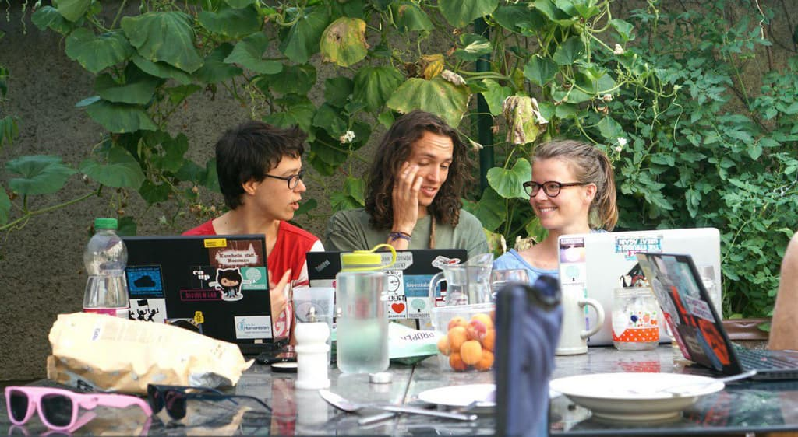
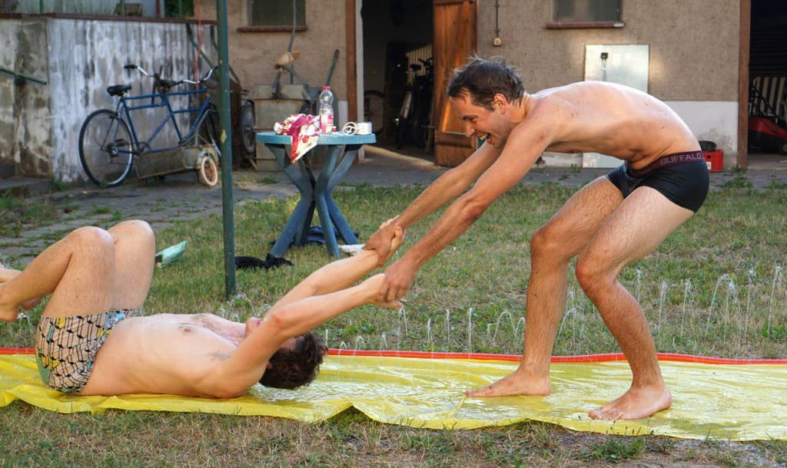
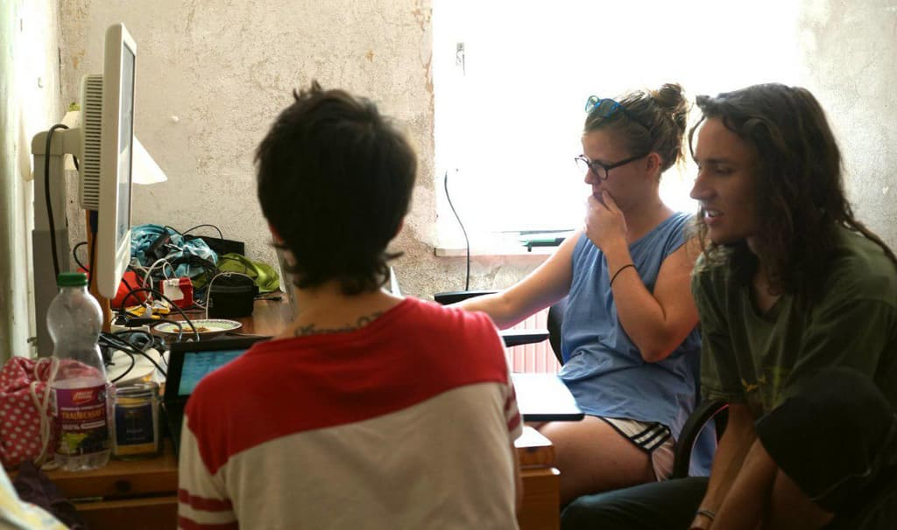

Exactly one month ago Tais and me started our Summer of Karrot and a few hours ago the pull request we have been working on got merged!

So what does this mean? It means that we took giant leaps forward in our journey to learn coding! :D

===

Last year we made the plan to apply for the [Rails Girls Summer of Code](https://github.com/yunity/karrot-frontend) program, which helps women to get started with open source programming. We always knew that the only project we really wanted to work on is [Karrot](https://github.com/yunity/karrot-frontend), given the fact that we have been involved with it from the very beginning and Tilmann and Nick being the main devs of the project.

We did not get chosen for the Rails Girls thing, but we had months to build up anticipation and skills in preparation of a focused time of learning how to code on a real project. That led to us deciding to pull through with it anyways: Nick and Tais joined Tilmann and me in Kanthaus and we put all our time and energy into Karrot for a whole month!

Having two teachers for two students sounds pretty good already, but it got even better: Chandi volunteered spontaneously for teaching us the very basics and got us started with _the_ classic of learning a new programming language: The todo list. He had us create a todo list in jQuery for two days before we started approaching [Vue.js](https://vuejs.org/) - the JavaScript framework that is used in Karrot frontend. It was nice to take it a bit easy in the beginning, to get clearer on some terms, technologies and workflows before jumping right into the huge pool of cold water that was the code of Karrot.

_Chandi teaching us jQuery_

We worked on the new group applications feature and started with a long session about how that feature should actually look like, the outcomes being:
- a new user can click an 'apply' button on the GroupGallery (the overview page that lists all groups)
- the user is then taken to a new page in which questions from the group need to be answered (the ApplicationForm)
- a new field in the GroupEdit page is needed so that the group can specify these questions
- if no questions are specified we will provide default questions
- existing members of the group get notified via mail about the new application
- existing members of the groups see a new banner on the GroupWall that informs them about pending applications
- clicking that banner takes the existing user to the new ApplicationList page, that displays all applications
- in the ApplicationList existing members can accept or decline a pending application, as well as access the ApplicationChat
- the ApplicationChat displays the questions and answers from the ApplicationForm on top
- the ApplicationChat is a conversation between the applicant all all existing mebers of the group
- the applicant can access the ApplicationChat via the GroupGallery or via the email notification that follows an application
- the applicant can also withdraw the application via the GroupGallery
- groups with a pending application are somehow marked in the GroupGallery

As you can see, this is a quite big feature and nobody of us expected this to be done at the end of the month. And let's be honest: it's not. The backend was written by Tilmann aynway, because we wanted to focus on frontend development, but we also omitted the ApplicationChat for the first merge. That means a pretty integral part of the feature is still missing. However, it's completely functional even without the chat and we won't roll it our to the users like this - it's just [deployed to the beta version](https://dev.karrot.world) now, so that other people can look at it and test it.

_Tilmann and Nick taking a break from sharing all that knowledge_

There are many online courses that teach coding, many documentations of language features and libraries, but none of those in isolation can prepare you for working with a real code base that has its own structure, inherent logic and interdependencies. The first week of doing actual Karrot development were a very emotional time. In one moment we felt stupid and completely lost and in the other we were super proud of having figured something out. There was just so much input and so many things to keep in mind all at once! Getting the syntax right, knowing where the data flows, having an understanding of what sequence of characters belongs to which layer of the code - what comes from JavaScript, what from vue, what from custom Karrot things, what from a library - getting a feeling of what is important for solving a specific problem and what can be ignored, not getting confused with reading the same names in different contexts for similar things which are still not the _same_... >.<

The waves of confusion closed in on us time and time again, but we didn't lose focus and in the end we got sufficiently good at navigating the code base of Karrot, to appropriately make use of all the tools that could help us, to cope with the frustration and to work as a team to produce working code. The last two weeks felt extremely productive already and we figured out many things all by ourselves.

_Once more in front of the laptops_

So if you are interested in learning programming as well, our main insights might help you:
- Even the best devs often don't know what's going on - they just don't give up trying to solve the mystery!
- Looking up things online is not cheating - it's a vital part of effective coding!
- Debugging is the most important skill of all - use the consoles and all their features!
- Coding is a team sport - there's no shame in asking for help if you're stuck!

For getting started the free online courses are pretty awesome actually - we also did them! [Freecodecamp](http://freecodecamp.org/) is the page Tais and me both used to learn about HTML, CSS, jQuery and JavaScript when we were completely green. It's free, it's fun and you easily learn the basics of web development, I can wholeheartedly recommend trying it out! :)
