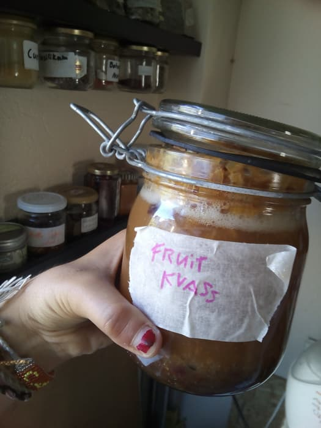
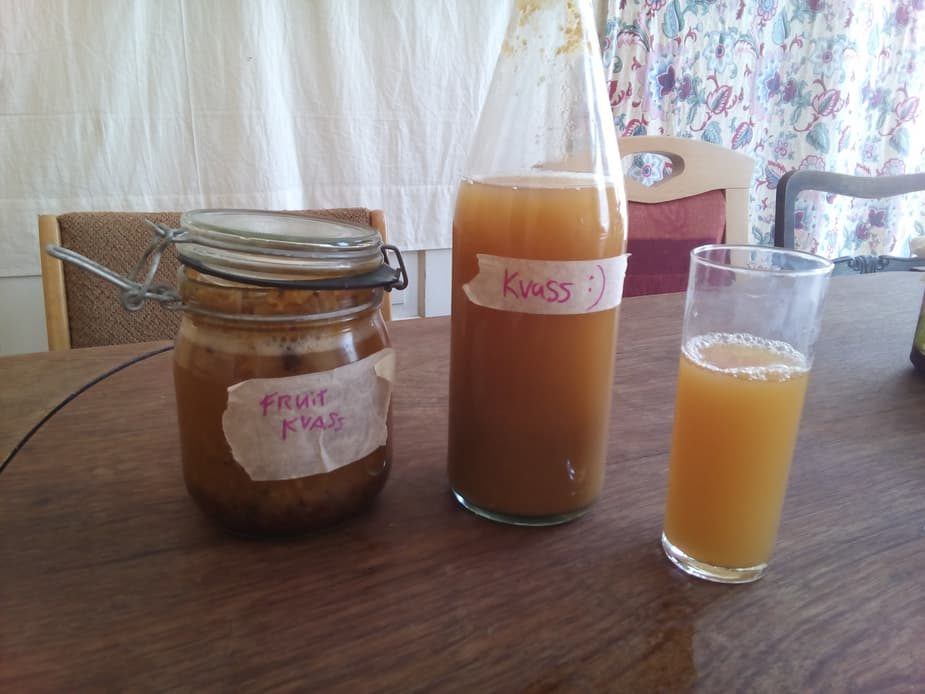

## Traditionell slavisch-baltisch fermentiertes Getränk: Kwas

[Kwas](https://de.wikipedia.org/wiki/Kwas) ist ein Limonade-ähnliches fermentiertes Getränk, das normalerweise aus Brot oder Mehl gemacht wird (Gerste, Weizen, Roggen und so weiter). Vermutlich hat es eine ähnliche Herkunftsgeschicht und ein änhliches Alter wie Bier [(Quelle)](https://www.enjoyyourcooking.com/beverage-recipes/russian-rye-bread-drink-kvass.html).

===

Traditionelles Kwas wird in etwa aus folgenden Zutaten hergestellt:
- ½ bis 1 Pfund Roggenbrot oder anderes Brot
- knapp 4 Liter Wasser
- 300 g Zucker (braun oder weiß, Honig, Datteln…
- eine kleine Handvoll getrocknete Kräuter zum Aromatisieren
- 12 g Rosinen
- 120–180 ml Kwas-Starterhefe oder Bierhefe

Da wir aber gerade einen ganzen Haufen gekochte Früchte übrig hatten (von einem mißglückten Maremaldenversuch…), entschied ich mich etwas mir Neues zu probieren:

## Obst-Kwas

Und - wow - sobald ich anfing über Obst-Kwas zu lesen fand ich heraus, dass Kwas so gut wie keine Grenzen kennt - so viele verschiedene Zutaten können verwendet werden, um es herzustellen! Von Sauerkraut über Beeren, von Brot zu simplem Mehl. Das Einzige, was immer gebraucht wird ist Wasser, Hefe und etwas Zucker. Zucker kann man aber auch ersetzen durch süße Früchte, Säfte, Kuchen, Gemüse… Man kann Kräuter hinzufügen, damit es besser schmeckt, oder Mehl, um die Hefe besser wachsen zu lassen wenn man den Eindruck hat, dass sie sonst stirbt. Aber generell ist es kein großer Aufwand eine Kwas-Kultur zu pflegen - sie fermentiert einfach so vor sich hin, ohne dass man ihr viel Aufmerksamkeit schenken müsste.  
[Diese Website](http://www.kvass.biz/gemuse/) hat eine tolle Auswahl an Kwas-Ideen.

Unser Obst-Kwas war aus Mirabellen, die wir einen Tag vorher beim See gesammelt haben. Zusätzlich verwendeten wir die Kwas-Starterhefe, die ich vorher schon während meiner ersten Kwas-Experimente im Kanthaus gemacht hatte. Die war zuerst eine Starterhefe aus dem Laden, die ich aber schon mit Wasser, Zucker und gekochtem Brot aktiviert hatte, sodass die Hefe bereits sehr aktiv war. Ich füllte einige Gläser mit den Früchten, der Hefekultur und etws Wasser. In eines gab ich zusätzlichen Zucker, um zu schauen, inwiefern das einen Unterschied machen würde - ich glaube die süßere Mischung wurde etwas stärker alkoholisch…

Bei dem warmem Wetter warenn schon nach einem Tag alle Mischungen blubberig und limonadig. Nach zwei Tagen waren sie perfekt und ich filterte die Flüssigkeit ab ab. Die Früchte sammelte ich in einem großen Glas und stellte sie in den Kühlschrank.

Irgendwelche Fragen? :)  
Guten Durst!

