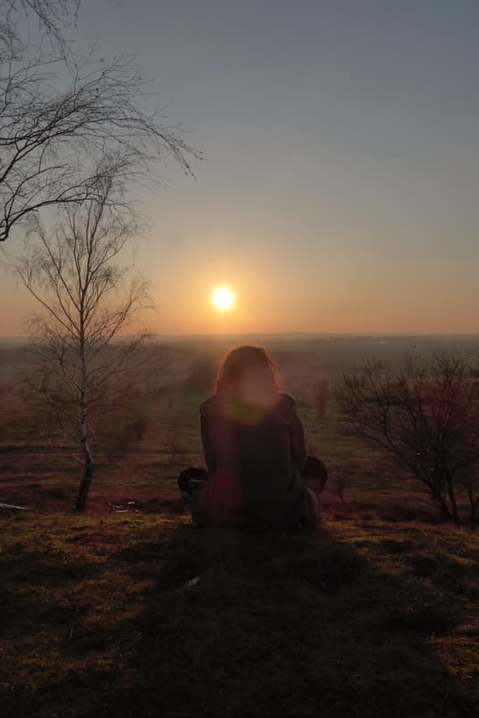
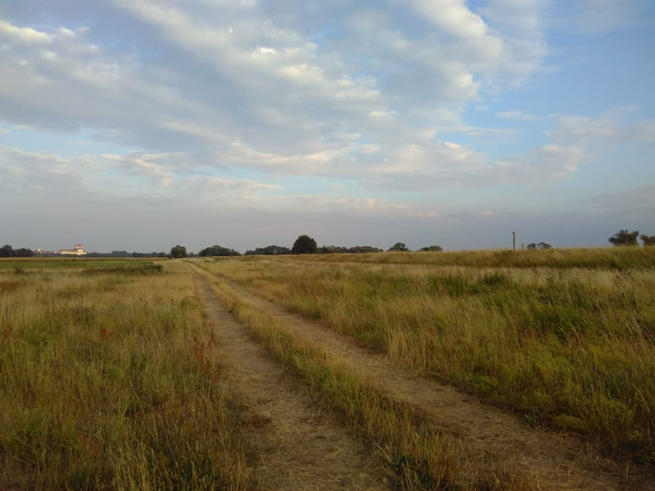

My involvement with [yunity](https://yunity.org/en) and Kanthaus is a huge learning process for me. Since I got to know this group of people, I went through many phases of doing things and of being - happy, amazed, fulfilled, sad, angry,...  
I want to herewith share some thoughts and experiences with you.

===

One of the main things that made me stay and work together with you guys was that you _do_ what you want to see different. By this I mean what others might call work: actively and responsibly engaging with stuff to do. So first I was very motivated, inspired and also doing all the time! :-)  
Until my being and my doing came a bit out of balance. I became a bit unhappy, unfulfilled, wanting and needing to do evermore. I realized that actively practicing _being_ and taking time for this is also very important. By this I mean having relaxed talks, being in nature, not doing anything, coming to myself, meditating, not talking about stuff to do, ...
And in order to be happy - and I want to be happy - I need a balance.

Because of the way we live with this group of people, we are free to determine ourselves when we do stuff and when we don't; what we do and what we prioritize, without pressure from outside. As a group we enable each other to be _doing_ useful stuff to make the world a better place and also live together - therefore also _be_ together. Working and private life don't have a clear separation. This is a great privilege. And it is different to the norm of society and therefore not always easy.

Sometimes I tend to get the very unpleasant and disagreeable feeling of  
"I haven't done enough. Maybe I am not contributing enough and others do work for me".  
I ask myself what things still have to be done, what I should do, what others should do. And there is always stuff to do and no end to it. That's normal: we are idealists and if our utopia would be reality we would start dreaming new dreams.

Yet, it becomes problematic for me when I don't have the mental space to relax and be happy. When I am just trapped in this feeling of "having-to-work-but-not-knowing-when-it-is-enough-and-not-being-able-to-really-relax-and-be-happy restlessness". I can have it even when I am lying in a hammock ;-) ! Up to the point where I am constantly thinking about what there is to _de_ but I don't find the energy do to it because I want to practice _being_ right now. And then I neither _am_ nor do I _do_... well that's not ideal.

I need and want a balance of doing and being.
Finding and staying in the balance of these two therefore is my aim.

I want to be deeply fulfilled and happy. For this I need to feel like I am doing useful stuff _and_ I need time to reflect, relax and enjoy. Celebrating needs to be as much part of a creative circle as dreaming, planning and doing as far as I know [dragon dreaming](http://www.dragondreaming.org/) ;-)

What could possibly help?  
Let me _be_. And be happy that I am.  
Support me in taking time out, relaxing, meditating, looking into the air, enjoying, doing nothing. Ask me if I can _be_ enough, tell others to let me be, ask me how I feel, tell me that it's good, give me the feeling that I have done enough that it's good for now. Be positive about things. Chill out with me.
Let's celebrate being done.

And one more idea:
In order to try something out I might aim at doing 2-3 hours of care work (cleaning, tidying, cooking, looking out for someone) and 3-4 hours of work on projects a day. (Can also be care work of course ;-) )
And in the rest of the time consciously not _do_ stuff but _be_.
