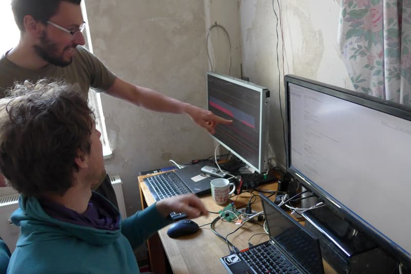
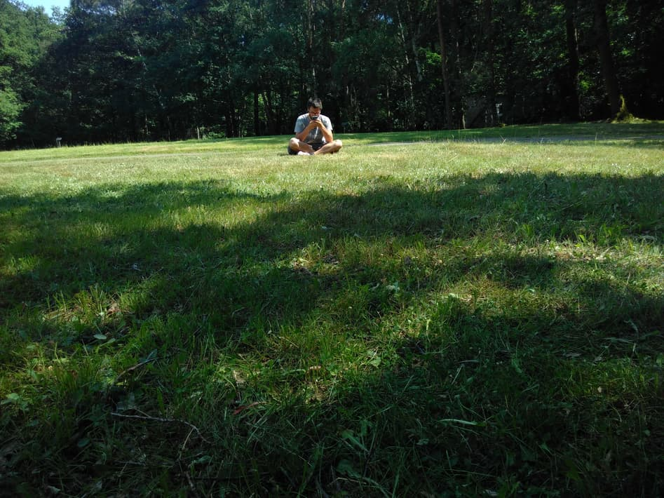

"Stop _doing_ so much, try to _be_ more" or similar sentences is what I get to hear often. I am a person who gets up early, is busy with a lot of different things throughout the day, not managing to just "lie down and relax" often.

When I feel the need to relax from task A, I grab task B instead. When that feels too much for me, I might be inclined to even start a new task. There might be a task management problem with that, which actually sometimes stresses me out a bit, but I get happiness through the underlying process.

===

The point is: I really like what I do.  
I am intrinsically motivated to look out for problems, grab them, analyze them, think about them, read about them and try to solve them.

I feel happy, get calm, can get rid of a headache by executing a fulfilling task.

"But can't you also just stop for a moment?"  
Well, yes, I can. It often leads to me being bored.  
I notice a strong urge arising in myself.
When my thoughts start appearing, I might get focused and lost in something so much that I cannot concentrate on anything else anymore.
It would be sooo cool if I did it like that, could it work out? How do I start? I want to do that now.

For sure, I might also be in situations where I enjoy spending time with a person or a group of people without doing anything productive.
It can be a quite intense time even, it is just that this to me feels like holiday.
I am unable to be on holiday for weeks, I would rather use the time to continue one of the thousand things I have in my mind - or start thing 1001.

That does not mean that I don't need time to think about thoughts, feelings, emotions and meaning.
A simple, repetitive task is where I can do this best.

Washing up, mowing the lawn, preparing tea, mopping the floor, sitting in a meeting I am not interested in - these are good opportunities for me to reflect, think about myself, etc.
It gives me energy, provides me with an overview of what is going on with me: what do I want, what am I missing?

Meditating, sitting with a group of people, just sitting somewhere with a notebook - it is not that this doesn't work at all for me, but it is draining.
It may allow me to focus on some feelings, get some details clear, but I don't enjoy it.
Invite me into two hours of such a section and I might fall asleep afterwards.

Whenever something arises in me, I feel that I would like to do something about it by getting active.
- It feels like I am not bringing a change to the world I would like to see? Well, back to work. Alternatively, think about and try a different work.
- Too many things going on in my head? Make a list, start at the top. Be fulfilled, whenever a thing gets ticked.
- Feeling sad through emotions I cannot change? Grab a task. Either a simple one to be able to go deeper into the feelings, otherwise something that occupies my brain.

I was inspired to writing this blog post two weeks ago when I read [one about more being than doing](../2018-08-16_balance-doing-being).
I am not 100% satisfied with the way I laid out the points as I would like to make you understand how I feel, be and do.  
That doing is right for me :-)  
That I am happy even when I complain a bit.  
That I generally enjoy my life although there is always room to change it.
