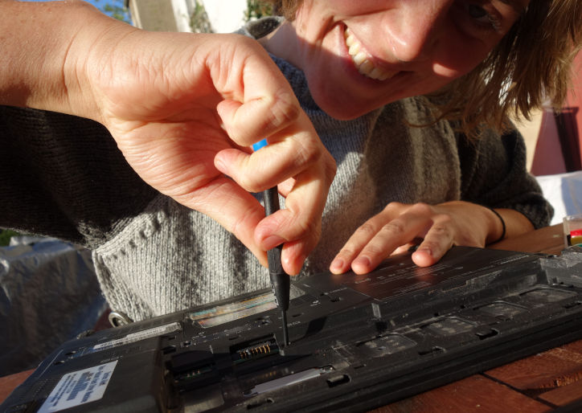

Ein Reparier-und Techniktreff, auch Repair Café genannt, ist ein regelmäßiger Treffpunkt um kaputte Gegenstände wieder benutzbar zu machen und dabei Unterstützung von Menschen zu bekommen, die sich damit etwas besser auskennen (Selbsthilfewerkstatt). 
Im Kanthaus findet jeden Dienstag von 17-19Uhr eines statt.

===

Die Einladung dazu findet ihr [hier](https://kanthaus.online/de/projects/repaircafe)

 Matthias ist der Hauptbetreuer und empfängt seit April 2018 jede Woche zwischen 2 und 3 Menschen. Manche sind gerade sowieso im Kanthaus, manche wohnen in der Stadt und kommen extra in die Kantstraße. Mit engerer oder weniger engerer Anleitung - je nach Fähigkeiten - wird hier alles Mögliche repariert. Von Fahrrädern über Lampen und Verstärker bis hin zu Laptops, Toastern und Salzstreuern. Wenn etwas nicht mehr reparierbar ist, werden meist noch verwertbare Teile ausgebaut und dann wird zum Beispiel ein Kippschalter in einer anderen Lampe, deren eigener Schalter defekt war, wieder eingebaut. 

Hier zwei Erfahrungsberichte von September 2018:
_Als ich das letzte Mal im Repair Café im Kanthaus war, half mir Matthias dabei den kaputten Schließmechanismus der Waschmaschinentür zu reparieren und zeigte mir voller Enthusiasmus und sehr viel Geduld z.B. wie man einen Akkuschrauber bedient. Es ist super, dass es hier die Möglichkeit gibt sich an neue Dinge zu wagen und auszuprobieren. Das Ganze hat außerdem noch sehr viel Spaß gemacht und am Ende hat auch die Waschmaschine wieder funktioniert!
Larissa_

 

_Letzte Woche im Repaircafé habe ich meinen Computer auseinandergebaut. Die eine Maustaste hatte sich immer von selber gedrückt, was ziemlich nervig war. Das Auseinandernehmen war echt nicht so schwer, dann haben wir die Taste von Innen mit Isopropanol schön sauber gemacht und alles wieder zusammengebaut. Danach hat alles wieder funktioniert, voll cool :-) Ohne Matthias und das Repair Café hätte ich das nicht hingekriegt.
Laurina_

 

