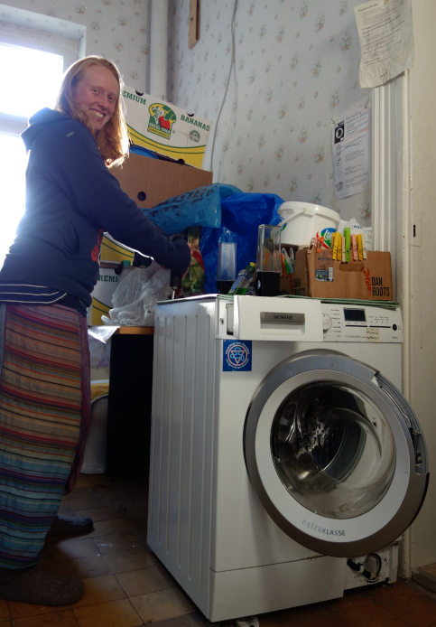

When people come together regularly to fix broken devices with the help of others who might have more skills and knowledge in the field, that's called repair cafe. It's a place and event for people to learn and try out things with technology.

Kanthaus hosts a repair cafe every Tuesday from 5 to 7 pm. 
[Click here](https://kanthaus.online/projects/repaircafe) to read the invitation.

===

Matthias is the main host of our repair cafe and since April 2018 he welcomes 2-3 people every week. Some are staying at Kanthaus anyways, some live in Wurzen and come over for the event specifically. Depending on the skill level of each attendant there is more or less guidance when whatever broken object gets repaired. It can be anything really, from bikes, toasters and salt shakers to laptops, amplifiers and mobiles. If something cannot be repaired, it will be taken apart so that still working parts can be of use in other objects. Like the switch of an irreversibly broken lamp that is now controlling the light of another lamp that was out of order before.

Here's two personal reports from September 2018:

> Last time I was attending Kanthaus' repair cafe Matthias helped me repairing the broken locking mechanism of the washing machine. He even showed me how to operate an electric drill with lots of enthusiasm and patience. It's awesome to have the opportunity to try out new things here. On top of that is was super fun and the washing machine was working again in the end! 
> – Larissa

 
_Larissa and the washing machine_

> I disassembled my computer in last week's repair cafe. One of the mouse buttons used to annoyingly press itself all the time. Taking apart the laptop was pretty easy. Then we cleaned the button from the inside using isopropanol and put everything back together. It worked perfectly afterwards, so great! :-) Without Matthias and the repair cafe I would not have been able to do this. 
> – Laurina_

 
_Laurina repairs her laptop_
