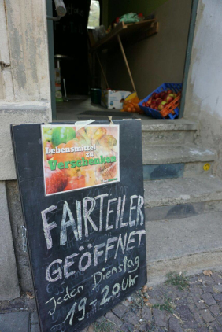
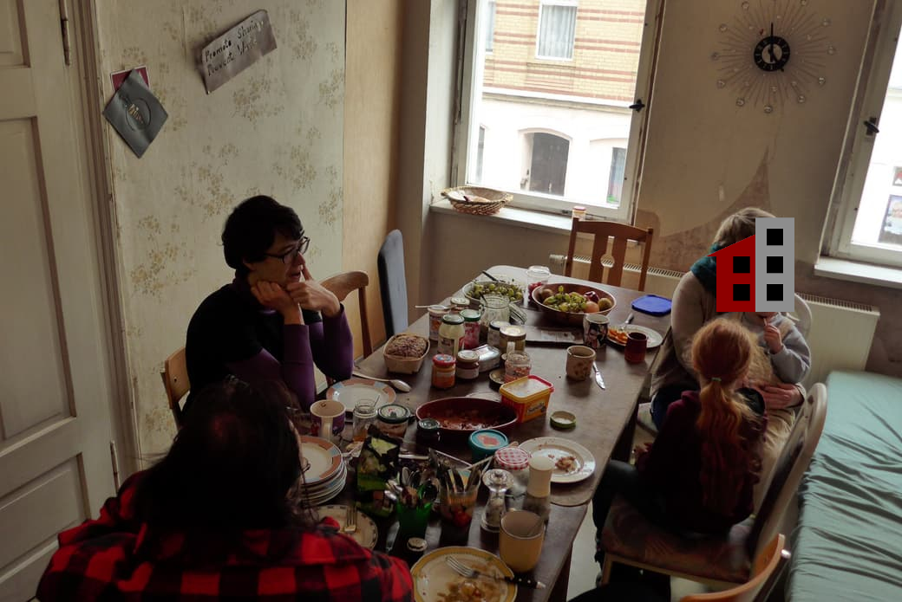
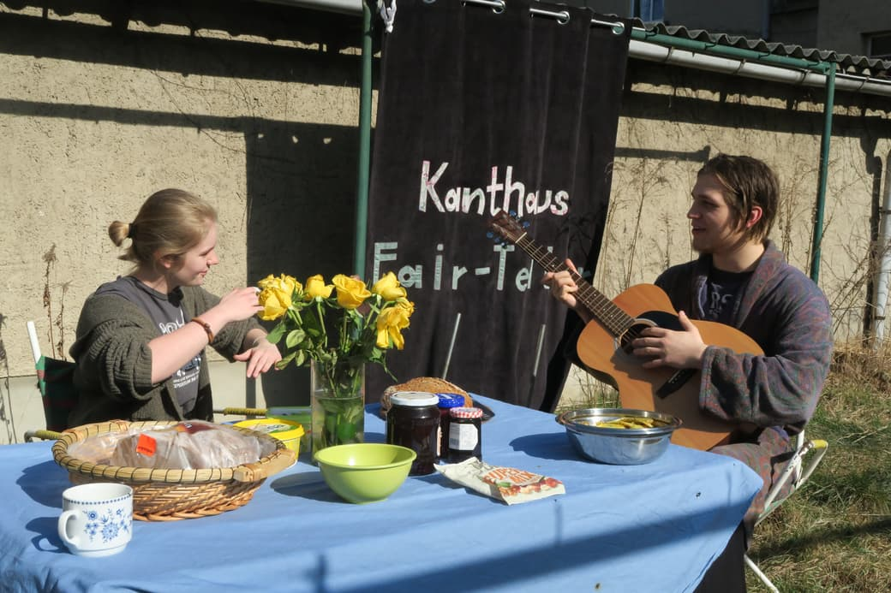
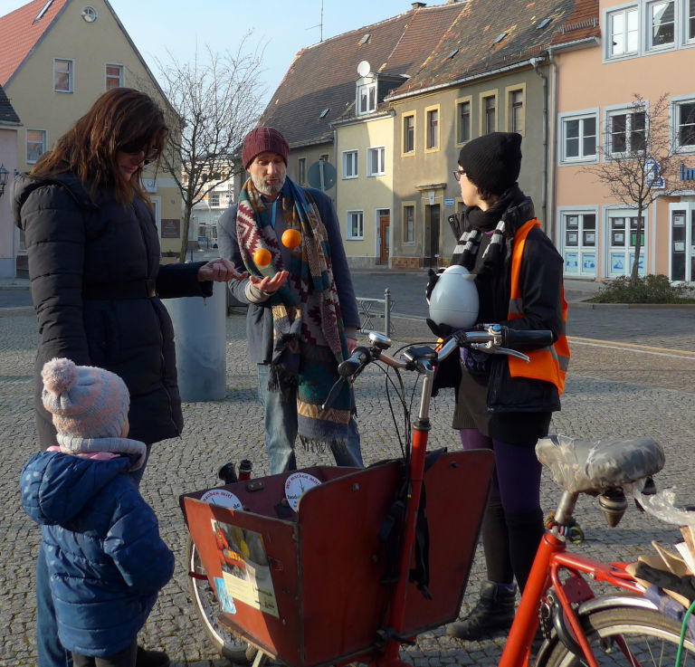

Foodsharing is an organization and an online platform in Germany, Austria and Switzerland, which supports saving and sharing of food in general, as well as direct pickups at stores and producers. Kanthaus has a lot going on when it comes to foodsharing! 
This is a little report.

===

Since August 2018 we open our 'Fairteiler' (Food-Share Point) every Tuesday from 7 pm to 8 pm. Every week somebody else take care of this, but it's mostly people staying at Kanthaus at the given time. During this time people can bring and/or take surplus food. It's an easy way to reduce food waste, to personally waste less, and to share more.

>_The fairteiler already seems to have regulars, despite being open for less then two months. Yesterday one of them brought a friend. The free sharing experience - regardless of status, income, etc- is inspiring for users, some of whom were using the recently closed Tafel. It's a nice place to meet and chat with people who are just walking by too. 
>Doug_

 
_Our Food-Share Point in Kantstraße 22_

The foodsharing leftover-brunch and the foodsharing Wurzen planning meeting also happen once a month at Kanthaus. The leftover-brunch is about coming together in a relaxed atmosphere and to eat what was left over during the week (hence the name), to discuss recipes and specialties, foodsharing and ways of preserving food, and to generally open up a space for people to simply talk to each other. It takes place every 2nd Sunday of the month, from 11 am to 1 pm. The planning meetings are about building and maintaining a foodsharing infrastructure in Wurzen and the Muldental district. There we plan upcoming events to inform people about foodsharing, discuss possibilities of getting new cooperations with stores, the current status of the Food-Share Point, and much more depending on the tasks at hand. It happens every 2nd Thursday a month from 7 pm to 8 pm. Janina mostly takes care of both these events.

> The foodsharing leftover-brunch, we also call it open breakfast, is always a surprise: You never know who will show up and what food will be on the table in the end. We also have a handful of people showing up quite regularly and from the mom with the little kid to the pensioner the whole age range is represented. While sitting together and eating one gets into conversation and I love that! And whenever someone completely new comes by for the brunch, I'm especially happy! 
> – Janina

 
_Sometimes we eat inside..._

 
_...and sometimes outside._

In March 2018 and in September 2018 we hosted national co-working days for foodsharing. The board of the Foodsharing e.V. association met for a productive meeting [a german blogpost here](https://foodsharing.de/?page=blog&sub=read&id=231) 
and in September the foodsharing co-working days happened. 10 people where working on updating the foodsharing Wiki, develop the software and coordination for the initiative. Also the run-up in organization for the foodsharing festival was done here. It took place in Berlin directly after the co-working days.

And even more is happening!
The Organization and storage of [Foodsharing on Festivals] (https://wiki.foodsharing.de/Foodsharing_auf_Festivals) and the web development [see the blog here](https://devblog.foodsharing.de/index.en.html) are taking place in kanthaus.
Also read the project description of [Foodsharing Wurzen](https://kanthaus.online/en/projects/foodsharing).

Click around, there is a lot to discover. Or join in and be part! :-)

