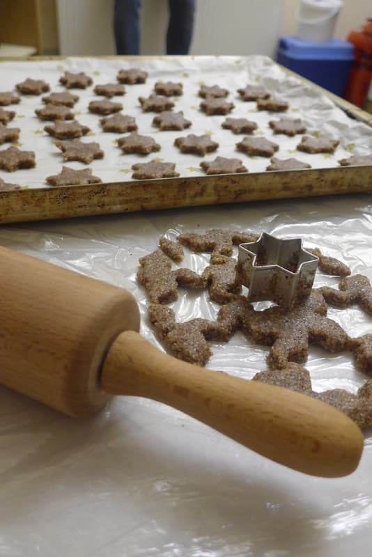
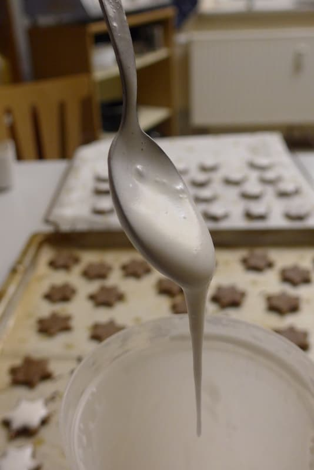

Ah, how delightful is wintertime!

Even in Kanthaus there are 4 candles of which 3 are already lit and in whose flickering light subversive Christmas carols are sung. An advent calendar is put up on the wall and the cotton bags are filled carefully by many different people. They put self-composed poems in there, dumpster-dived treasures, wintery fables, words of praise or handy kitchen utensils. It's a new surprise every day!

Once every few days you can smell a scent of cookies in the staircase which lures the Kanthausianer to the cozy dining room. Then they all sit together around the big oak table, sip tea, crack tons of walnuts and nibble the Christmassy treats. Until all the cookie jars are empty and production needs to start again. That was the case yesterday….

 
_Cookies in the making_

In my mind I already play rock-paper-scissors against myself to decide the kind of cookies I'm gonna make next, while Doug finishes the last bits of Findus' nut triangles. With a big grin he leaves me the empty box and I take that as the signal to begin. So I first drain the chickpeas, put them aside and start whipping the saved water.

Wait. *Chickpeas?!* 
Wasn't this article supposed to be about sweet Christmas baking? 
Exactly!

I decided to make vegan cinnamon stars. The base for this recipe is [aquafaba](https://en.wikipedia.org/wiki/Aquafaba), which makes for the perfect substitute for beaten egg whites if whipped and mixed with sugar. It can be used to make baked goods less dense, as vegan marshmallow creme, just as it is and for making vegan meringue.

And what can I say? After two hours of handling the sticky goodness, the cinnamon stars are done and I am covered in a good amount of their ingredients. But most of all I'm very excited about the new recipe and everybody who comes into the kitchen has to get a taste of my sweet aquafaba. A perfect way to make use of the leftovers. I don't think I'll ever again be able to cook with chickpeas without having a plan for the streaky, viscous water.

 
_Aquafaba with baking soda and powdered sugar, that's it..._

Ingredients, for approx. 5 trays

- 120 ml chickpea water
- 0,50 tsp. baking soda
- 250 g powdered sugar
- 1 pck. vanilla sugar
- 1 tsp. cinnamon
- 800 g ground almonds

1. For the 'fake beaten egg whites' put the chickpea water into a bowl and add the baking soda. Use a handheld electric mixer on its highest setting and beat for 2-3 minutes, until clear traces that don't go away by themselves can be seen in the creme.
2. Add in the powdered sugar in small amounts and continue beating on highest setting until everything is well-blended and has a shiny, sticky texture. Put aside 5 tbs for later usage as icing.
3. Carefully mix vanilla sugar and cinnamon into the large part of the creme. Then add ground almonds until you have a homogenous dough that does not stick to the bowl.
4. Put the dough between two sheets of plastic wrap and roll it to 0,5 – 1 cm thickness. Then remove the wrap and cut stars.
5. Heat the oven to 130 °C. Add the icing to the stars. This might take a while due to the high viscosity of the material. For me a teaspoon worked best.
6. Bake for 20 minutes in the preheated oven. When taking them out the stars should still be a little soft.
