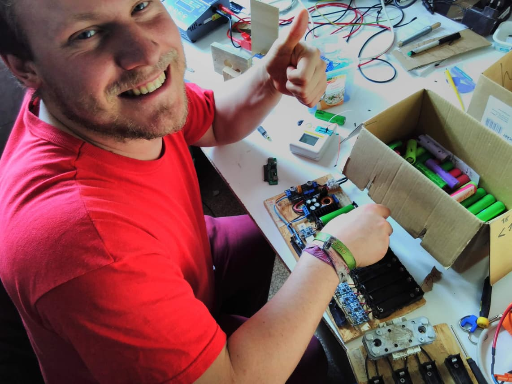

We are delighted to announce that we got a considerable amount of money from the [Postcode Lottery](https://www.postcode-lotterie.de/) to realize a project that combines pretty much all Kanthaus purposes:

We will design and build modular 48V lithium batteries to save and use solar energy. We will do so using decommissioned batteries from old laptops. That way we can give new life to resources that were already seen as trash, prevent unnecessary mining of raw materials (e.g. lithium and cobalt) that has
[devastating consequences for people and the environment in the global South](https://www.theguardian.com/global-development/2018/oct/12/phone-misery-children-congo-cobalt-mines-drc) and equip ourselves with light, cycle-proof, high-current energy storage devices.

===

The first step is to plan and layout how our batteries will be wired up, then we will build them, potentially extend our solar power supply and then finally build an electrically driven cargo bike and trailer of the type [Carla Cargo](https://www.carlacargo.de/).

And how does this reflect all [Kanthaus purposes](https://kanthaus.online/governance/constitution#purposes)? Well, it helps us–

- to promote sharing and reduce waste.
  _Because we'll use old batteries._
- to develop free and open-source software.
  _Because we'll need software to charge and monitor the batteries._
- to provide and connect public and common resources.
  _Because we'll make guides, tutorials and the outcomes available to others._
- to give what we can, take what need and facilitate others to do the same.
  _Because we'll show how one can make use of things already there._
- to generally have a jolly good time.
  _Because it's gonna be a lot of fun!_

Stay tuned for more information of this project! :)

 
_Bodhi is looking forward to get going soon!_
