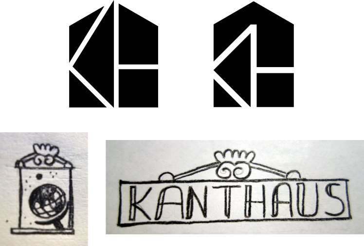
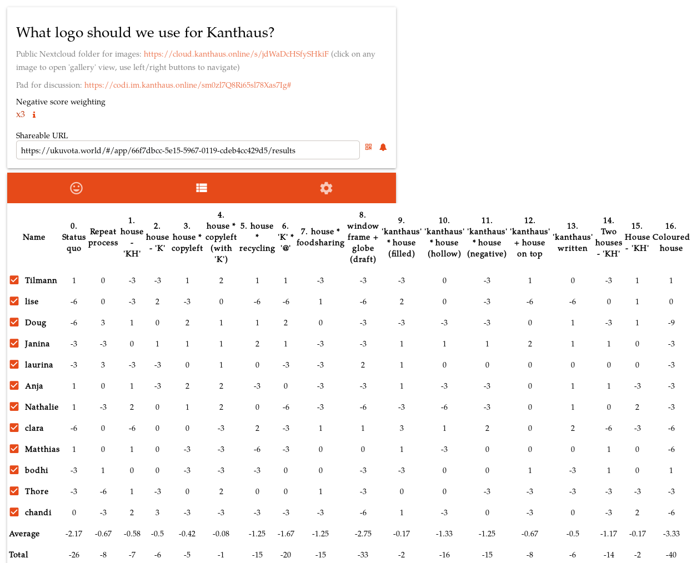
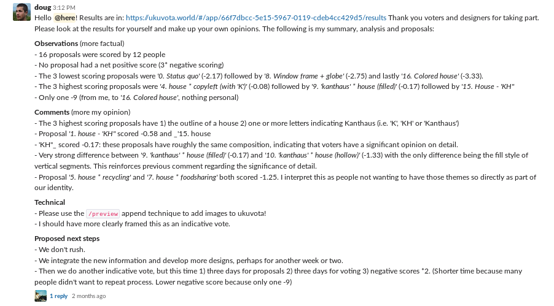
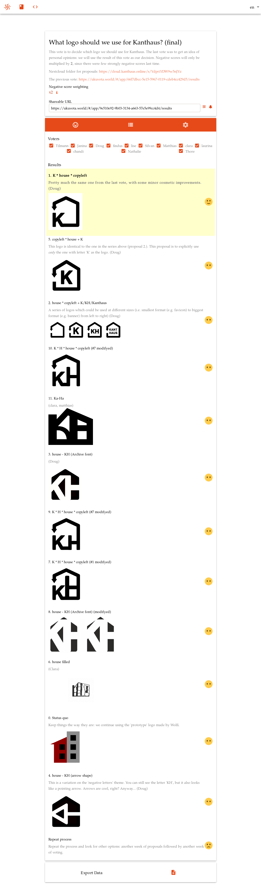

We had talked about wanting to have a nice new logo for a long time already, but a few months ago Laurina and Doug started coming up with new ideas again. This started the process that in the end gave us this awesome and widely accepted new logo:

 
_Decided after two rounds of voting with 9 points of acceptance_

===

---

Every change in Kanthaus begins with somebody feeling motivated and inspired to work on something. In the best case it's due to the pure feeling of enjoyment tackling a task can provide, a burst of creativity and the intrinsic motivation to act on one's ideas. But let's be honest, often it's also because the status quo is just not good the way it is.

Our old logo was made by Wolfi one and a half years ago and he never intended it to stay. It was more of a placeholder than anything else. I guess it still was good enough to serve a purpose for quite some time and I have to say that I actually did like it a bit. I mean it was a building with edges, which translates nicely to 'Kanthaus' ('Kante' means edge in German)...^^

 
_Look at this edgy building; who wouldn't see the charm..?_

 
_But already the first proposals looked much better, didn't they?_

So, when Laurina and Doug brought up the topic again our other artsy people joined in and soon we had proposals from Silvan and Clara, too. Now we needed to come to a decision, but since we already had Wolfi's placeholder logo in use for so long and this time we wanted to do it right, we (that means Doug...) came up with a nicely dynamic process:
1. Collect raw sketches and ideas
2. Let people vote on them to find out which ones are worth spending more time on
3. Refine the worthy proposals
4. Have a final vote to decide the new logo

When we make a decision that is important (because it affects everyone or because it cannot be undone) we use [score voting](https://en.wikipedia.org/wiki/Score_voting). The biggest advantage of this system is that everyone can give an opinion on every single proposal which reflects real perceptions in a much more nuanced way than binary majority vote where voting _for_ one proposal basically means voting _against_ all others.

Fortunately, Wolfi created [Ukuvota](https://ukuvota.world) to make it easier for people to have score votings online. It's the platform we always use when making important decisions. On Ukuvota you can specify a time frame for the proposal phase and one for the voting phase, as well as the weight of negative votes. We always have two control proposals in the list of things to vote on. Those are 'Keep the status quo' (called simply 'Status quo') and 'Let's look for other proposals and start over' (called 'Repeat process') and they ensure that every possible perception can be expressed - even if someone doesn't like any of the proposals and/or would rather keep everything the way it is. This is heavily inspired by [systemic consensus](http://www.plays-in-business.com/systemic-consensing-what-the-hell-is-this/) and [our usage of this system](https://yunity.atlassian.net/wiki/spaces/YUN/pages/13828248/Systemic+consensus) dates back to [yunity](https://yunity.org) times. More information on the ideas and voting mechanics used in Ukuvota can be found in its [manual](https://ukuvota.world/#/manual).

For the first logo vote we had 7 days for proposals and then again 7 days for voting. That seemed like enough time for people to react and worked out pretty well. The negative score weight was set to 3 which resulted in a voting scale of -9, -6, -3, 0, 1, 2, 3. Remember: The highest sum score wins in the end, which means that with this setting resistance votes are quite powerful.

 
_The detailed results page of the first voting round_

After this voting round Doug analyzed the outcomes and came to the following conclusions:

 
_Clara's comment read 'Sounds good, let's do it!'_

So we followed Doug's plan, the proposals were refined and after some more weeks there was another vote - this time to really determine the exact file we'd use as _the_ Kanthaus logo in the future.

We had many great proposals and a clear winner in the end:

_All proposals of the second voting round sorted by score_

And that's it, that's how we got our new logo everybody is happy with! ^\_^ The process how we got to it highlights several important principles of Kanthaus:

- Iterations
  - Nothing needs to be perfect at the first try. Constant improvement is what we're aiming for.
- Flexibility
  - We have general structures with enough vagueness to accommodate for the specificities of every single case.
- Communication
  - It's people who make processes, not the other way around. If we agree on something, we can simply make it happen.
- Do-ocracy
  - If someone wants to lead an action, it's normally appreciated.
