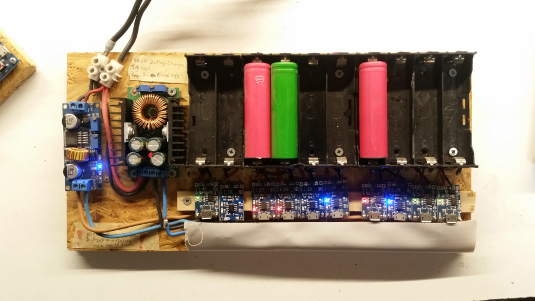
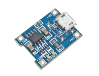
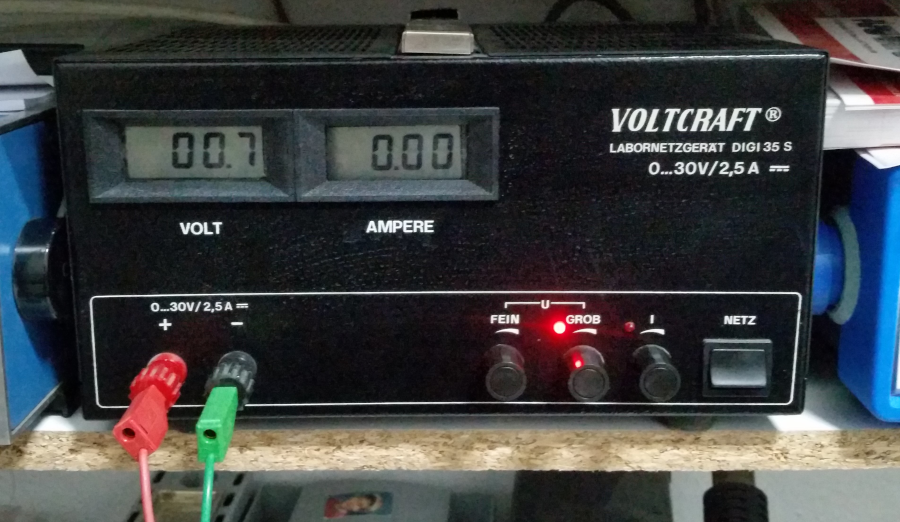
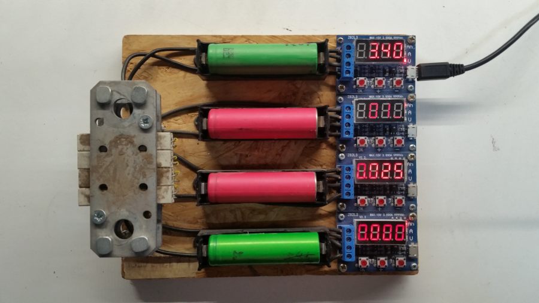
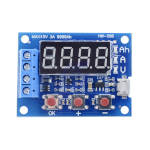
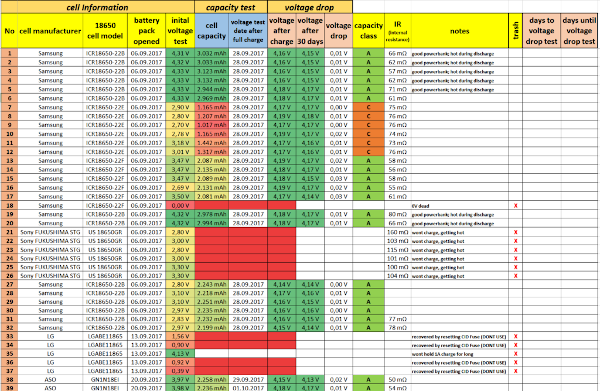

Aktuell sind _Lithium-Ionen_ die vorherschende Batterietechnik. Die hohe Energiedichte ist gerade für leichte Akkus von Vorteil und ermöglichen erst Anwendungen wie das Elektroauto, welches mit anderen Technologien wie Blei viel zu schwer werden würde.

Mehrere einzelne Zellen werden jeweils zu großen Akku-Packs zusammengeschlossen um höhere Leistungen zu ermöglichen.

Das Problem dabei: sollte eine Zelle defekt sein muss meist das ganze Pack entsorgt werden, obwohl die vielleicht 40 anderen Zellen eigentlich noch vollkommen in Ordnung wären.

===

Diese Ressourcenverschwendung wirkt in Anbetracht der ökologischen und sozialen Belastung z.B. in Südamerika, die der derzeitige Lithiumabbau darstellt, um so fataler.[^1] Dazu kommen viele weitere umweltbelastende Stoffe wie Kobalt, Nickel und Chrom. [^2]

Wir möchten diese wertvollen, voll funktionsfähigen Zellen noch weiter nutzen ohne erst die Rohstoffe mit komplexen und energieintensiven Recyclingverfahren zu extrahieren[^3], nur um letztlich vielleicht höchstens die Hälfte[^4] wieder verwenden zu können.

Im folgenden Artikel zeigen wir auf, wie wir aus alten Laptopakkus Zellen gewinnen, diese messen, neu zusammenbauen und mit Schutzschaltungen versehen, um am Ende ein Lastenfahrrad und Projekträume im Kanthaus autark mit Ökostrom zu versorgen.

## Bauform 18650

Li-Ion Zellen gibt es in allen Formen und Farben. Am verbreitetsten ist wohl die 18650 Bauform, etwas größer als eine AA Batterie. Wir haben uns aufgrund der hohen Vefügbarkeit auf diese spezialisiert.

#### Quellen
- Laptopakkus
- Akkuschrauber-Akkus
- Elektroscooter-Akkus
- Elektroauto
- Powerbanks
- ...

## Achtung!
Wir arbeiten hier mit Akkus, welche sich bei falscher Handhabung entzünden und sogar explodieren können. Dazu kommt, dass das Löschen der Akkus äußerst schwierig ist[^5]. Du solltest also wissen was du tust, dich über Gefahren & Handhabung eingelesen haben, gute Kentnisse der Elektronik besitzen und alle notwendigen Sicherheitsvorkehrungen getroffen haben.

## Zerlegen
Dazu gibt es viele anschauliche Anleitungen auf bekannten Videoportale zu finden. Die wichtigsten Hinweise sind:

- Auf Pole achten und immer zuerst möglichst alle Leitungen abklemmen. Du solltest dir immer bewusst sein, bei welchen Teilen welche Spannung anliegt und wie du Kurzschlüsse verhinderst.
- Handschuhe tragen! (Die Nickelstreifen sind sehr scharfkantig)
- Metall am Arm ablegen bzw abkleben (Ringe, Festivalbänder, etc.)

## Zellen testen
Um den Zustand einer Zelle zu erkennen und sie auch anschließend passend im Pack anzuordnen, müssen wir sie erstmal messen. Dazu haben wir uns auf einen Prozess festgelegt, den wir zum Messen aller Zellen anwenden, um Vergleichbarkeit herzustellen.

### Vorgang
<svg id="mermaid-1582044720267" width="100%" xmlns="http://www.w3.org/2000/svg" style="max-width: 790.002498626709px;" viewBox="0 0 790.002498626709 2924.4515686035156"><g transform="translate(-12, -12)"><g class="output"><g class="clusters"></g><g class="edgePaths"><g class="edgePath" style="opacity: 1;"><path class="path" d="M459.58374786376953,59.71665954589844L459.58374786376953,84.71665954589844L459.58374786376953,109.71665954589844" marker-end="url(#arrowhead116)" style="fill:none"></path><defs><marker id="arrowhead116" viewBox="0 0 10 10" refX="9" refY="5" markerUnits="strokeWidth" markerWidth="8" markerHeight="6" orient="auto"><path d="M 0 0 L 10 5 L 0 10 z" class="arrowheadPath" style="stroke-width: 1px; stroke-dasharray: 1px, 0px;"></path></marker></defs></g><g class="edgePath" style="opacity: 1;"><path class="path" d="M459.58374786376953,169.14999389648438L459.58374786376953,194.14999389648438L459.58374786376953,219.14999389648438" marker-end="url(#arrowhead117)" style="fill:none"></path><defs><marker id="arrowhead117" viewBox="0 0 10 10" refX="9" refY="5" markerUnits="strokeWidth" markerWidth="8" markerHeight="6" orient="auto"><path d="M 0 0 L 10 5 L 0 10 z" class="arrowheadPath" style="stroke-width: 1px; stroke-dasharray: 1px, 0px;"></path></marker></defs></g><g class="edgePath" style="opacity: 1;"><path class="path" d="M459.58374786376953,278.5833282470703L459.58374786376953,303.5833282470703L460.08374786376953,329.0833290100099" marker-end="url(#arrowhead118)" style="fill:none"></path><defs><marker id="arrowhead118" viewBox="0 0 10 10" refX="9" refY="5" markerUnits="strokeWidth" markerWidth="8" markerHeight="6" orient="auto"><path d="M 0 0 L 10 5 L 0 10 z" class="arrowheadPath" style="stroke-width: 1px; stroke-dasharray: 1px, 0px;"></path></marker></defs></g><g class="edgePath" style="opacity: 1;"><path class="path" d="M492.48196926348515,449.8801012016027L541.28125,516.6366500854492L541.28125,551.4949798583984" marker-end="url(#arrowhead119)" style="fill:none"></path><defs><marker id="arrowhead119" viewBox="0 0 10 10" refX="9" refY="5" markerUnits="strokeWidth" markerWidth="8" markerHeight="6" orient="auto"><path d="M 0 0 L 10 5 L 0 10 z" class="arrowheadPath" style="stroke-width: 1px; stroke-dasharray: 1px, 0px;"></path></marker></defs></g><g class="edgePath" style="opacity: 1;"><path class="path" d="M412.48235231480015,434.67692552647014L276.61249923706055,516.6366500854492L276.61249923706055,591.0699768066406L276.61249923706055,655.6449737548828L276.61249923706055,800.5399780273438L276.61249923706055,955.2933120727539L276.61249923706055,1115.094139099121L276.61249923706055,1274.8949661254883L305.50348301013804,1319.6116333007812" marker-end="url(#arrowhead120)" style="fill:none"></path><defs><marker id="arrowhead120" viewBox="0 0 10 10" refX="9" refY="5" markerUnits="strokeWidth" markerWidth="8" markerHeight="6" orient="auto"><path d="M 0 0 L 10 5 L 0 10 z" class="arrowheadPath" style="stroke-width: 1px; stroke-dasharray: 1px, 0px;"></path></marker></defs></g><g class="edgePath" style="opacity: 1;"><path class="path" d="M541.28125,630.6449737548828L541.28125,655.6449737548828L541.7812500000001,681.1449775695802" marker-end="url(#arrowhead121)" style="fill:none"></path><defs><marker id="arrowhead121" viewBox="0 0 10 10" refX="9" refY="5" markerUnits="strokeWidth" markerWidth="8" markerHeight="6" orient="auto"><path d="M 0 0 L 10 5 L 0 10 z" class="arrowheadPath" style="stroke-width: 1px; stroke-dasharray: 1px, 0px;"></path></marker></defs></g><g class="edgePath" style="opacity: 1;"><path class="path" d="M487.86252686450473,867.0162553496119L414.810001373291,955.2933120727539L414.810001373291,1085.3774719238281" marker-end="url(#arrowhead122)" style="fill:none"></path><defs><marker id="arrowhead122" viewBox="0 0 10 10" refX="9" refY="5" markerUnits="strokeWidth" markerWidth="8" markerHeight="6" orient="auto"><path d="M 0 0 L 10 5 L 0 10 z" class="arrowheadPath" style="stroke-width: 1px; stroke-dasharray: 1px, 0px;"></path></marker></defs></g><g class="edgePath" style="opacity: 1;"><path class="path" d="M595.6999697044329,867.0162511512794L667.752498626709,955.2933120727539L668.2524986267086,990.6516418457034" marker-end="url(#arrowhead123)" style="fill:none"></path><defs><marker id="arrowhead123" viewBox="0 0 10 10" refX="9" refY="5" markerUnits="strokeWidth" markerWidth="8" markerHeight="6" orient="auto"><path d="M 0 0 L 10 5 L 0 10 z" class="arrowheadPath" style="stroke-width: 1px; stroke-dasharray: 1px, 0px;"></path></marker></defs></g><g class="edgePath" style="opacity: 1;"><path class="path" d="M683.823185754326,1224.9659492249218L690.502498626709,1274.8949661254883L690.502498626709,1309.7532958984375" marker-end="url(#arrowhead124)" style="fill:none"></path><defs><marker id="arrowhead124" viewBox="0 0 10 10" refX="9" refY="5" markerUnits="strokeWidth" markerWidth="8" markerHeight="6" orient="auto"><path d="M 0 0 L 10 5 L 0 10 z" class="arrowheadPath" style="stroke-width: 1px; stroke-dasharray: 1px, 0px;"></path></marker></defs></g><g class="edgePath" style="opacity: 1;"><path class="path" d="M609.6307439171643,1181.9148816429945L526.502498626709,1274.8949661254883L382.35053294215976,1319.6116333007812" marker-end="url(#arrowhead125)" style="fill:none"></path><defs><marker id="arrowhead125" viewBox="0 0 10 10" refX="9" refY="5" markerUnits="strokeWidth" markerWidth="8" markerHeight="6" orient="auto"><path d="M 0 0 L 10 5 L 0 10 z" class="arrowheadPath" style="stroke-width: 1px; stroke-dasharray: 1px, 0px;"></path></marker></defs></g><g class="edgePath" style="opacity: 1;"><path class="path" d="M318.33374786376953,1359.3282928466797L318.33374786376953,1394.1866302490234L318.83374786376953,1419.6866325378414" marker-end="url(#arrowhead126)" style="fill:none"></path><defs><marker id="arrowhead126" viewBox="0 0 10 10" refX="9" refY="5" markerUnits="strokeWidth" markerWidth="8" markerHeight="6" orient="auto"><path d="M 0 0 L 10 5 L 0 10 z" class="arrowheadPath" style="stroke-width: 1px; stroke-dasharray: 1px, 0px;"></path></marker></defs></g><g class="edgePath" style="opacity: 1;"><path class="path" d="M276.26951846173176,1555.7123994736944L205.25,1632.6349563598633L205.75,1667.9932876586913" marker-end="url(#arrowhead127)" style="fill:none"></path><defs><marker id="arrowhead127" viewBox="0 0 10 10" refX="9" refY="5" markerUnits="strokeWidth" markerWidth="8" markerHeight="6" orient="auto"><path d="M 0 0 L 10 5 L 0 10 z" class="arrowheadPath" style="stroke-width: 1px; stroke-dasharray: 1px, 0px;"></path></marker></defs></g><g class="edgePath" style="opacity: 1;"><path class="path" d="M361.3979794478286,1555.7124018693103L431.41749572753906,1632.6349563598633L431.41749572753906,1745.8024520874023" marker-end="url(#arrowhead128)" style="fill:none"></path><defs><marker id="arrowhead128" viewBox="0 0 10 10" refX="9" refY="5" markerUnits="strokeWidth" markerWidth="8" markerHeight="6" orient="auto"><path d="M 0 0 L 10 5 L 0 10 z" class="arrowheadPath" style="stroke-width: 1px; stroke-dasharray: 1px, 0px;"></path></marker></defs></g><g class="edgePath" style="opacity: 1;"><path class="path" d="M161.93175878285476,1820.5100378966245L98,1898.6866073608398L98,1933.544937133789" marker-end="url(#arrowhead129)" style="fill:none"></path><defs><marker id="arrowhead129" viewBox="0 0 10 10" refX="9" refY="5" markerUnits="strokeWidth" markerWidth="8" markerHeight="6" orient="auto"><path d="M 0 0 L 10 5 L 0 10 z" class="arrowheadPath" style="stroke-width: 1px; stroke-dasharray: 1px, 0px;"></path></marker></defs></g><g class="edgePath" style="opacity: 1;"><path class="path" d="M249.5682425793342,1820.5100395861937L312.5,1898.6866073608398L312.5,1933.544937133789" marker-end="url(#arrowhead130)" style="fill:none"></path><defs><marker id="arrowhead130" viewBox="0 0 10 10" refX="9" refY="5" markerUnits="strokeWidth" markerWidth="8" markerHeight="6" orient="auto"><path d="M 0 0 L 10 5 L 0 10 z" class="arrowheadPath" style="stroke-width: 1px; stroke-dasharray: 1px, 0px;"></path></marker></defs></g><g class="edgePath" style="opacity: 1;"><path class="path" d="M312.5,1992.978271484375L312.5,2017.978271484375L312.5,2042.978271484375" marker-end="url(#arrowhead131)" style="fill:none"></path><defs><marker id="arrowhead131" viewBox="0 0 10 10" refX="9" refY="5" markerUnits="strokeWidth" markerWidth="8" markerHeight="6" orient="auto"><path d="M 0 0 L 10 5 L 0 10 z" class="arrowheadPath" style="stroke-width: 1px; stroke-dasharray: 1px, 0px;"></path></marker></defs></g><g class="edgePath" style="opacity: 1;"><path class="path" d="M312.5,2082.6949310302734L312.5,2107.6949310302734L312.5,2132.6949310302734" marker-end="url(#arrowhead132)" style="fill:none"></path><defs><marker id="arrowhead132" viewBox="0 0 10 10" refX="9" refY="5" markerUnits="strokeWidth" markerWidth="8" markerHeight="6" orient="auto"><path d="M 0 0 L 10 5 L 0 10 z" class="arrowheadPath" style="stroke-width: 1px; stroke-dasharray: 1px, 0px;"></path></marker></defs></g><g class="edgePath" style="opacity: 1;"><path class="path" d="M312.5,2192.1282653808594L312.5,2217.1282653808594L312.5,2242.1282653808594" marker-end="url(#arrowhead133)" style="fill:none"></path><defs><marker id="arrowhead133" viewBox="0 0 10 10" refX="9" refY="5" markerUnits="strokeWidth" markerWidth="8" markerHeight="6" orient="auto"><path d="M 0 0 L 10 5 L 0 10 z" class="arrowheadPath" style="stroke-width: 1px; stroke-dasharray: 1px, 0px;"></path></marker></defs></g><g class="edgePath" style="opacity: 1;"><path class="path" d="M312.5,2301.5615997314453L312.5,2326.5615997314453L312.5,2351.5615997314453" marker-end="url(#arrowhead134)" style="fill:none"></path><defs><marker id="arrowhead134" viewBox="0 0 10 10" refX="9" refY="5" markerUnits="strokeWidth" markerWidth="8" markerHeight="6" orient="auto"><path d="M 0 0 L 10 5 L 0 10 z" class="arrowheadPath" style="stroke-width: 1px; stroke-dasharray: 1px, 0px;"></path></marker></defs></g><g class="edgePath" style="opacity: 1;"><path class="path" d="M312.5,2391.2782592773438L312.5,2416.2782592773438L312.5,2441.2782592773438" marker-end="url(#arrowhead135)" style="fill:none"></path><defs><marker id="arrowhead135" viewBox="0 0 10 10" refX="9" refY="5" markerUnits="strokeWidth" markerWidth="8" markerHeight="6" orient="auto"><path d="M 0 0 L 10 5 L 0 10 z" class="arrowheadPath" style="stroke-width: 1px; stroke-dasharray: 1px, 0px;"></path></marker></defs></g><g class="edgePath" style="opacity: 1;"><path class="path" d="M312.5,2500.7115936279297L312.5,2525.7115936279297L313.00000000000006,2551.2115959167472" marker-end="url(#arrowhead136)" style="fill:none"></path><defs><marker id="arrowhead136" viewBox="0 0 10 10" refX="9" refY="5" markerUnits="strokeWidth" markerWidth="8" markerHeight="6" orient="auto"><path d="M 0 0 L 10 5 L 0 10 z" class="arrowheadPath" style="stroke-width: 1px; stroke-dasharray: 1px, 0px;"></path></marker></defs></g><g class="edgePath" style="opacity: 1;"><path class="path" d="M274.4075046436014,2691.20909689824L218,2764.1599197387695L218,2799.0182495117188" marker-end="url(#arrowhead137)" style="fill:none"></path><defs><marker id="arrowhead137" viewBox="0 0 10 10" refX="9" refY="5" markerUnits="strokeWidth" markerWidth="8" markerHeight="6" orient="auto"><path d="M 0 0 L 10 5 L 0 10 z" class="arrowheadPath" style="stroke-width: 1px; stroke-dasharray: 1px, 0px;"></path></marker></defs></g><g class="edgePath" style="opacity: 1;"><path class="path" d="M351.59249733481204,2691.2090994974637L407,2764.1599197387695L407,2799.0182495117188" marker-end="url(#arrowhead138)" style="fill:none"></path><defs><marker id="arrowhead138" viewBox="0 0 10 10" refX="9" refY="5" markerUnits="strokeWidth" markerWidth="8" markerHeight="6" orient="auto"><path d="M 0 0 L 10 5 L 0 10 z" class="arrowheadPath" style="stroke-width: 1px; stroke-dasharray: 1px, 0px;"></path></marker></defs></g><g class="edgePath" style="opacity: 1;"><path class="path" d="M407,2838.734909057617L407,2863.734909057617L407,2888.734909057617" marker-end="url(#arrowhead139)" style="fill:none"></path><defs><marker id="arrowhead139" viewBox="0 0 10 10" refX="9" refY="5" markerUnits="strokeWidth" markerWidth="8" markerHeight="6" orient="auto"><path d="M 0 0 L 10 5 L 0 10 z" class="arrowheadPath" style="stroke-width: 1px; stroke-dasharray: 1px, 0px;"></path></marker></defs></g></g><g class="edgeLabels"><g class="edgeLabel" style="opacity: 1;" transform=""><g transform="translate(0,0)" class="label"><foreignObject width="0" height="0">

</foreignObject></g></g><g class="edgeLabel" style="opacity: 1;" transform=""><g transform="translate(0,0)" class="label"><foreignObject width="0" height="0">

</foreignObject></g></g><g class="edgeLabel" style="opacity: 1;" transform=""><g transform="translate(0,0)" class="label"><foreignObject width="0" height="0">

</foreignObject></g></g><g class="edgeLabel" style="opacity: 1;" transform="translate(541.28125,516.6366500854492)"><g transform="translate(-17,-9.858329772949219)" class="label"><foreignObject width="34" height="19.716659545898438">
Nein
</foreignObject></g></g><g class="edgeLabel" style="opacity: 1;" transform="translate(276.61249923706055,800.5399780273438)"><g transform="translate(-8.5,-9.858329772949219)" class="label"><foreignObject width="17" height="19.716659545898438">
Ja
</foreignObject></g></g><g class="edgeLabel" style="opacity: 1;" transform=""><g transform="translate(0,0)" class="label"><foreignObject width="0" height="0">

</foreignObject></g></g><g class="edgeLabel" style="opacity: 1;" transform="translate(414.810001373291,955.2933120727539)"><g transform="translate(-17,-9.858329772949219)" class="label"><foreignObject width="34" height="19.716659545898438">
Nein
</foreignObject></g></g><g class="edgeLabel" style="opacity: 1;" transform="translate(667.752498626709,955.2933120727539)"><g transform="translate(-8.5,-9.858329772949219)" class="label"><foreignObject width="17" height="19.716659545898438">
Ja
</foreignObject></g></g><g class="edgeLabel" style="opacity: 1;" transform="translate(690.502498626709,1274.8949661254883)"><g transform="translate(-17,-9.858329772949219)" class="label"><foreignObject width="34" height="19.716659545898438">
Nein
</foreignObject></g></g><g class="edgeLabel" style="opacity: 1;" transform="translate(526.502498626709,1274.8949661254883)"><g transform="translate(-8.5,-9.858329772949219)" class="label"><foreignObject width="17" height="19.716659545898438">
Ja
</foreignObject></g></g><g class="edgeLabel" style="opacity: 1;" transform=""><g transform="translate(0,0)" class="label"><foreignObject width="0" height="0">

</foreignObject></g></g><g class="edgeLabel" style="opacity: 1;" transform="translate(205.25,1632.6349563598633)"><g transform="translate(-17,-9.858329772949219)" class="label"><foreignObject width="34" height="19.716659545898438">
Nein
</foreignObject></g></g><g class="edgeLabel" style="opacity: 1;" transform="translate(431.41749572753906,1632.6349563598633)"><g transform="translate(-8.5,-9.858329772949219)" class="label"><foreignObject width="17" height="19.716659545898438">
Ja
</foreignObject></g></g><g class="edgeLabel" style="opacity: 1;" transform="translate(98,1898.6866073608398)"><g transform="translate(-8.5,-9.858329772949219)" class="label"><foreignObject width="17" height="19.716659545898438">
Ja
</foreignObject></g></g><g class="edgeLabel" style="opacity: 1;" transform="translate(312.5,1898.6866073608398)"><g transform="translate(-17,-9.858329772949219)" class="label"><foreignObject width="34" height="19.716659545898438">
Nein
</foreignObject></g></g><g class="edgeLabel" style="opacity: 1;" transform=""><g transform="translate(0,0)" class="label"><foreignObject width="0" height="0">

</foreignObject></g></g><g class="edgeLabel" style="opacity: 1;" transform=""><g transform="translate(0,0)" class="label"><foreignObject width="0" height="0">

</foreignObject></g></g><g class="edgeLabel" style="opacity: 1;" transform=""><g transform="translate(0,0)" class="label"><foreignObject width="0" height="0">

</foreignObject></g></g><g class="edgeLabel" style="opacity: 1;" transform=""><g transform="translate(0,0)" class="label"><foreignObject width="0" height="0">

</foreignObject></g></g><g class="edgeLabel" style="opacity: 1;" transform=""><g transform="translate(0,0)" class="label"><foreignObject width="0" height="0">

</foreignObject></g></g><g class="edgeLabel" style="opacity: 1;" transform=""><g transform="translate(0,0)" class="label"><foreignObject width="0" height="0">

</foreignObject></g></g><g class="edgeLabel" style="opacity: 1;" transform="translate(218,2764.1599197387695)"><g transform="translate(-8.5,-9.858329772949219)" class="label"><foreignObject width="17" height="19.716659545898438">
Ja
</foreignObject></g></g><g class="edgeLabel" style="opacity: 1;" transform="translate(407,2764.1599197387695)"><g transform="translate(-17,-9.858329772949219)" class="label"><foreignObject width="34" height="19.716659545898438">
Nein
</foreignObject></g></g><g class="edgeLabel" style="opacity: 1;" transform=""><g transform="translate(0,0)" class="label"><foreignObject width="0" height="0">

</foreignObject></g></g></g><g class="nodes"><g class="node" style="opacity: 1;" id="start" transform="translate(459.58374786376953,39.85832977294922)"><rect rx="5" ry="5" x="-31.25" y="-19.85832977294922" width="62.5" height="39.71665954589844"></rect><g class="label" transform="translate(0,0)"><g transform="translate(-21.25,-9.858329772949219)"><foreignObject width="42.5" height="19.716659545898438">
Start
</foreignObject></g></g></g><g class="node step" style="opacity: 1;" id="register" transform="translate(459.58374786376953,139.4333267211914)"><rect rx="5" ry="5" x="-90.75" y="-29.71666717529297" width="181.5" height="59.43333435058594"></rect><g class="label" transform="translate(0,0)"><g transform="translate(-80.75,-19.71666717529297)"><foreignObject width="161.5" height="39.43333435058594">
In Liste eintragen und mit ID versehen
</foreignObject></g></g></g><g class="node step" style="opacity: 1;" id="initialVoltage" transform="translate(459.58374786376953,248.86666107177734)"><rect rx="5" ry="5" x="-95" y="-29.71666717529297" width="190" height="59.43333435058594"></rect><g class="label" transform="translate(0,0)"><g transform="translate(-85,-19.71666717529297)"><foreignObject width="170" height="39.43333435058594">
Initiale Spannung Messen und Eintragen
</foreignObject></g></g></g><g class="node" style="opacity: 1;" id="initialVoltage2V" transform="translate(459.58374786376953,405.18082427978516)"><polygon points="76.5974967956543,0 153.1949935913086,-76.5974967956543 76.5974967956543,-153.1949935913086 0,-76.5974967956543" rx="5" ry="5" transform="translate(-76.5974967956543,76.5974967956543)"></polygon><g class="label" transform="translate(0,0)"><g transform="translate(-55.25,-9.858329772949219)"><foreignObject width="110.5" height="19.716659545898438">
Spannung &gt;2V?
</foreignObject></g></g></g><g class="node step" style="opacity: 1;" id="precharge" transform="translate(541.28125,591.0699768066406)"><rect rx="5" ry="5" x="-90.75" y="-39.57499694824219" width="181.5" height="79.14999389648438"></rect><g class="label" transform="translate(0,0)"><g transform="translate(-80.75,-29.574996948242188)"><foreignObject width="161.5" height="59.149993896484375">
Mit Labornetzteil vorsichtig vorladen 2V, max 0.05A
</foreignObject></g></g></g><g class="node" style="opacity: 1;" id="prechargeVoltage" transform="translate(541.28125,800.5399780273438)"><polygon points="119.89500045776367,0 239.79000091552734,-119.89500045776367 119.89500045776367,-239.79000091552734 0,-119.89500045776367" rx="5" ry="5" transform="translate(-119.89500045776367,119.89500045776367)"></polygon><g class="label" transform="translate(0,0)"><g transform="translate(-93.5,-19.71666717529297)"><foreignObject width="187" height="39.43333435058594">
Steigt Spannung sofort und kontinuierlich an?
</foreignObject></g></g></g><g class="node" style="opacity: 1;" id="prechargeKeep" transform="translate(667.752498626709,1115.094139099121)"><polygon points="124.94249725341797,0 249.88499450683594,-124.94249725341797 124.94249725341797,-249.88499450683594 0,-124.94249725341797" rx="5" ry="5" transform="translate(-124.94249725341797,124.94249725341797)"></polygon><g class="label" transform="translate(0,0)"><g transform="translate(-89.25,-29.574996948242188)"><foreignObject width="178.5" height="59.149993896484375">
Bleibt ohne Netzteil die Spannung von 2V erhalten?
</foreignObject></g></g></g><g class="node step" style="opacity: 1;" id="charge" transform="translate(318.33374786376953,1339.4699630737305)"><rect rx="5" ry="5" x="-129" y="-19.85832977294922" width="258" height="39.71665954589844"></rect><g class="label" transform="translate(0,0)"><g transform="translate(-119,-9.858329772949219)"><foreignObject width="238" height="19.716659545898438">
Mit Ladegerät auf 4.2V laden
</foreignObject></g></g></g><g class="node" style="opacity: 1;" id="gettinHot" transform="translate(318.33374786376953,1508.4816284179688)"><polygon points="89.29500045776368,0 178.59000091552736,-89.29500045776368 89.29500045776368,-178.59000091552736 0,-89.29500045776368" rx="5" ry="5" transform="translate(-89.29500045776368,89.29500045776368)"></polygon><g class="label" transform="translate(0,0)"><g transform="translate(-59.5,-19.71666717529297)"><foreignObject width="119" height="39.43333435058594">
Wir der Akku deutlich heiß?
</foreignObject></g></g></g><g class="node" style="opacity: 1;" id="gettinDone" transform="translate(205.25,1765.6607818603516)"><polygon points="98.16749725341798,0 196.33499450683595,-98.16749725341798 98.16749725341798,-196.33499450683595 0,-98.16749725341798" rx="5" ry="5" transform="translate(-98.16749725341798,98.16749725341798)"></polygon><g class="label" transform="translate(0,0)"><g transform="translate(-59.5,-29.574996948242188)"><foreignObject width="119" height="59.149993896484375">
Lädt der Akku nach 4 Stunden immer noch?
</foreignObject></g></g></g><g class="node trash" style="opacity: 1;" id="trashShort" transform="translate(414.810001373291,1115.094139099121)"><rect rx="5" ry="5" x="-78" y="-29.71666717529297" width="156" height="59.43333435058594"></rect><g class="label" transform="translate(0,0)"><g transform="translate(-68,-19.71666717529297)"><foreignObject width="136" height="39.43333435058594">
Kurzschluss! Vermerken &amp; Müll
</foreignObject></g></g></g><g class="node trash" style="opacity: 1;" id="trashHighRi" transform="translate(690.502498626709,1339.4699630737305)"><rect rx="5" ry="5" x="-103.5" y="-29.71666717529297" width="207" height="59.43333435058594"></rect><g class="label" transform="translate(0,0)"><g transform="translate(-93.5,-19.71666717529297)"><foreignObject width="187" height="39.43333435058594">
Hoher Innenwiderstand! Vermerken &amp; Müll
</foreignObject></g></g></g><g class="node trash" style="opacity: 1;" id="trashHeat" transform="translate(431.41749572753906,1765.6607818603516)"><rect rx="5" ry="5" x="-78" y="-19.85832977294922" width="156" height="39.71665954589844"></rect><g class="label" transform="translate(0,0)"><g transform="translate(-68,-9.858329772949219)"><foreignObject width="136" height="19.716659545898438">
Vermerken &amp; Müll
</foreignObject></g></g></g><g class="node trash" style="opacity: 1;" id="trashLoss" transform="translate(98,1963.261604309082)"><rect rx="5" ry="5" x="-78" y="-29.71666717529297" width="156" height="59.43333435058594"></rect><g class="label" transform="translate(0,0)"><g transform="translate(-68,-19.71666717529297)"><foreignObject width="136" height="39.43333435058594">
Energieverlust! Vermerken &amp; Müll
</foreignObject></g></g></g><g class="node step" style="opacity: 1;" id="discharge" transform="translate(312.5,1963.261604309082)"><rect rx="5" ry="5" x="-86.5" y="-29.71666717529297" width="173" height="59.43333435058594"></rect><g class="label" transform="translate(0,0)"><g transform="translate(-76.5,-19.71666717529297)"><foreignObject width="153" height="39.43333435058594">
Entladen &amp; messen1 2A, bis 3.2V
</foreignObject></g></g></g><g class="node step" style="opacity: 1;" id="noteCapacity" transform="translate(312.5,2062.836601257324)"><rect rx="5" ry="5" x="-90.75" y="-19.85832977294922" width="181.5" height="39.71665954589844"></rect><g class="label" transform="translate(0,0)"><g transform="translate(-80.75,-9.858329772949219)"><foreignObject width="161.5" height="19.716659545898438">
Kapazität vermerken
</foreignObject></g></g></g><g class="node step" style="opacity: 1;" id="recharge" transform="translate(312.5,2162.4115982055664)"><rect rx="5" ry="5" x="-52.5" y="-29.71666717529297" width="105" height="59.43333435058594"></rect><g class="label" transform="translate(0,0)"><g transform="translate(-42.5,-19.71666717529297)"><foreignObject width="85" height="39.43333435058594">
Wieder voll laden
</foreignObject></g></g></g><g class="node step" style="opacity: 1;" id="measureVoltage" transform="translate(312.5,2271.8449325561523)"><rect rx="5" ry="5" x="-73.75" y="-29.71666717529297" width="147.5" height="59.43333435058594"></rect><g class="label" transform="translate(0,0)"><g transform="translate(-63.75,-19.71666717529297)"><foreignObject width="127.5" height="39.43333435058594">
Spannung messen und vermerken
</foreignObject></g></g></g><g class="node" style="opacity: 1;" id="wait" transform="translate(312.5,2371.4199295043945)"><rect rx="5" ry="5" x="-78" y="-19.85832977294922" width="156" height="39.71665954589844" style="fill:#fff;"></rect><g class="label" transform="translate(0,0)"><g transform="translate(-68,-9.858329772949219)"><foreignObject width="136" height="19.716659545898438">
30 Tage abwarten
</foreignObject></g></g></g><g class="node step" style="opacity: 1;" id="measureVoltage2" transform="translate(312.5,2470.9949264526367)"><rect rx="5" ry="5" x="-73.75" y="-29.71666717529297" width="147.5" height="59.43333435058594"></rect><g class="label" transform="translate(0,0)"><g transform="translate(-63.75,-19.71666717529297)"><foreignObject width="127.5" height="39.43333435058594">
Spannung messen und vermerken
</foreignObject></g></g></g><g class="node" style="opacity: 1;" id="voltageDrop" transform="translate(312.5,2640.006591796875)"><polygon points="89.29500045776368,0 178.59000091552736,-89.29500045776368 89.29500045776368,-178.59000091552736 0,-89.29500045776368" rx="5" ry="5" transform="translate(-89.29500045776368,89.29500045776368)"></polygon><g class="label" transform="translate(0,0)"><g transform="translate(-59.5,-19.71666717529297)"><foreignObject width="119" height="39.43333435058594">
Spannungsabfall &gt;0.1V?
</foreignObject></g></g></g><g class="node trash" style="opacity: 1;" id="trashHighDrop" transform="translate(218,2818.876579284668)"><rect rx="5" ry="5" x="-78" y="-19.85832977294922" width="156" height="39.71665954589844"></rect><g class="label" transform="translate(0,0)"><g transform="translate(-68,-9.858329772949219)"><foreignObject width="136" height="19.716659545898438">
Vermerken &amp; Müll
</foreignObject></g></g></g><g class="node step" style="opacity: 1;" id="sortIn" transform="translate(407,2818.876579284668)"><rect rx="5" ry="5" x="-61" y="-19.85832977294922" width="122" height="39.71665954589844"></rect><g class="label" transform="translate(0,0)"><g transform="translate(-51,-9.858329772949219)"><foreignObject width="102" height="19.716659545898438">
Einsortieren
</foreignObject></g></g></g><g class="node" style="opacity: 1;" id="done" transform="translate(407,2908.5932388305664)"><rect rx="5" ry="5" x="-39.75" y="-19.85832977294922" width="79.5" height="39.71665954589844"></rect><g class="label" transform="translate(0,0)"><g transform="translate(-29.75,-9.858329772949219)"><foreignObject width="59.5" height="19.716659545898438">
Fertig!
</foreignObject></g></g></g></g></g></g></svg>

###### Anmerkungen
1. Mit 2A (genaugenommen 1.8Ω) Entladestrom  
   _Aufgrund des Innenwiderstandes der Zellen, bricht die Spannung bei stärkerer Last auch stärker ein. Um dem vorraussichtlichen Zweck entsprechend realistische Angaben zu erhalten, haben wir uns dazu entschieden mit einer Last von ~2A zu messen. Gemessene Ergebnisse liegen dadurch deutlich unter den Werten von konventionellen (Ent-)Ladegeräten._

## Benutzte Geräte
### Ladegerät

Um günstig möglichst viele Zellen gleichzeitig mit 1A zu laden.

###### Bestandteile
- TP4056-Modulen  

- 5V Netzteil (bei 10 Zellen min. 10A)

###### Achtung
- Module haben keinen Verpolschutz! Sobald eine Zelle verkehrt eingelegt wird, brennt das Modul durch und kann auch die Zelle beschädigen -> __Brandgefahr!__

### Labornetzteil

Zellen sind manchmal tiefenentladen (<2V). Die TP4056-Module verweigern dann die Ladung, aber die Zellen sind meist noch verwendbar. Diese werden dann sehr vorsichtig mit maximal 0.05A an einem Labornetzteil bis 2V geladen.

### Entladegerät

Kapazität Module,  ~2A Entladestrom

###### Bestandteile
- Kapazitätsmessmodul  
  
- 1,8Ω Lastwiderstand (>8W)
- Kühlkörper
- (optional) Lüfter

## Daten sammeln
Um den Überblick über die vielen Zellen zu wahren sammeln wir alle Werte in einer Tabelle:

Download: https://cloud.kanthaus.online/s/qoZfJemSg7Jpbyr

  
*Von [Philipp Seidel](https://blog.seidel-philipp.de/xxl-powerhouse-diy-feldakku-aus-18650-zellen/) kopiert und etwas an eigene Anforderungen angepasst*

## Weiter gehts...
Der erste Pack ist bereits gebaut und im nächsten Artikel werden wir etwas auf die Schwierigkeiten eingehen, die dabei zu Tage traten.

Desweiteren entwickeln wir derzeit ein eigenes Ladegerät, das uns diese vielen manuellen Schritte des Messprozesses abnimmt und die Daten vollautomatisch einträgt, welches natürlich als Open Source Projekt für alle zum Nachbau zugänglich sein wird.

Stay tuned!

 
<i>Gefördert durch die Deutsche Postcode Lotterie.</i>

[^1]: https://www.deutschlandfunk.de/lithiumabbau-in-chile-oekologisch-und-sozial-schwierige.697.de.html?dram:article_id=415667
[^2]: https://www.umweltbundesamt.de/sites/default/files/medien/378/publikationen/texte_27_2016_umweltbilanz_von_elektrofahrzeugen.pdf
[^3]: https://www.deutschlandfunk.de/elektromobilitaet-das-muehsame-recycling-von-lithium-ionen.676.de.html?dram:article_id=439121
[^4]: Burkert, A. ATZ Worldw (2018) 120: 10. https://doi.org/10.1007/s38311-018-0139-z
[^5]: https://www.zeit.de/mobilitaet/2018-11/elektromobilitaet-elektroautos-motoren-feuerwehr-sicherheit
