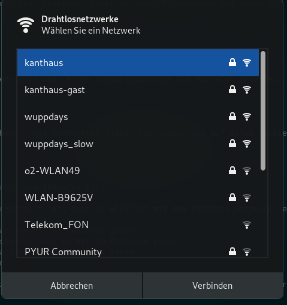
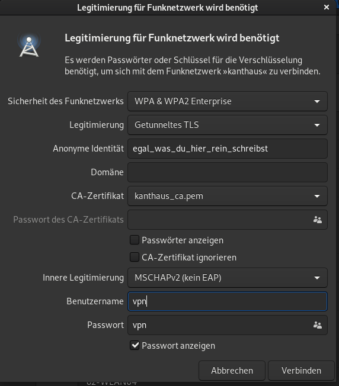
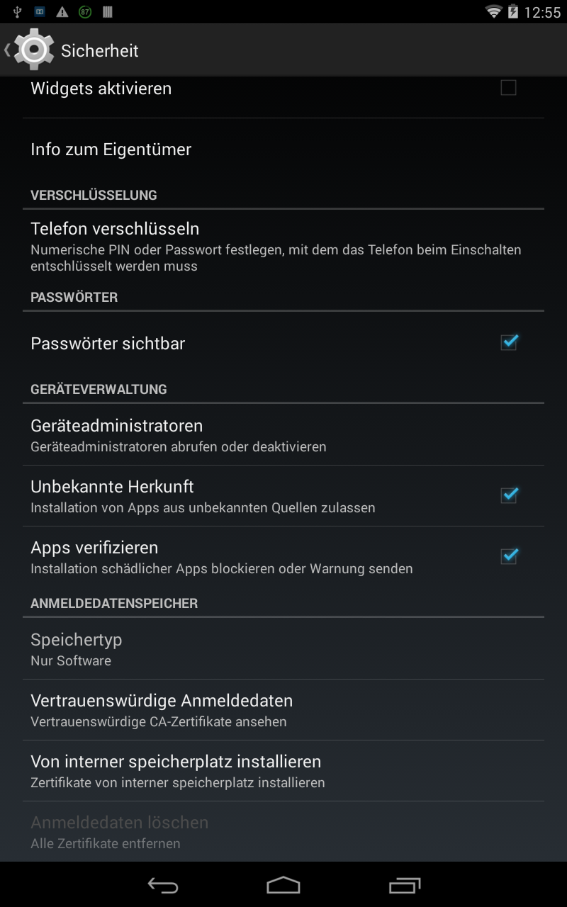
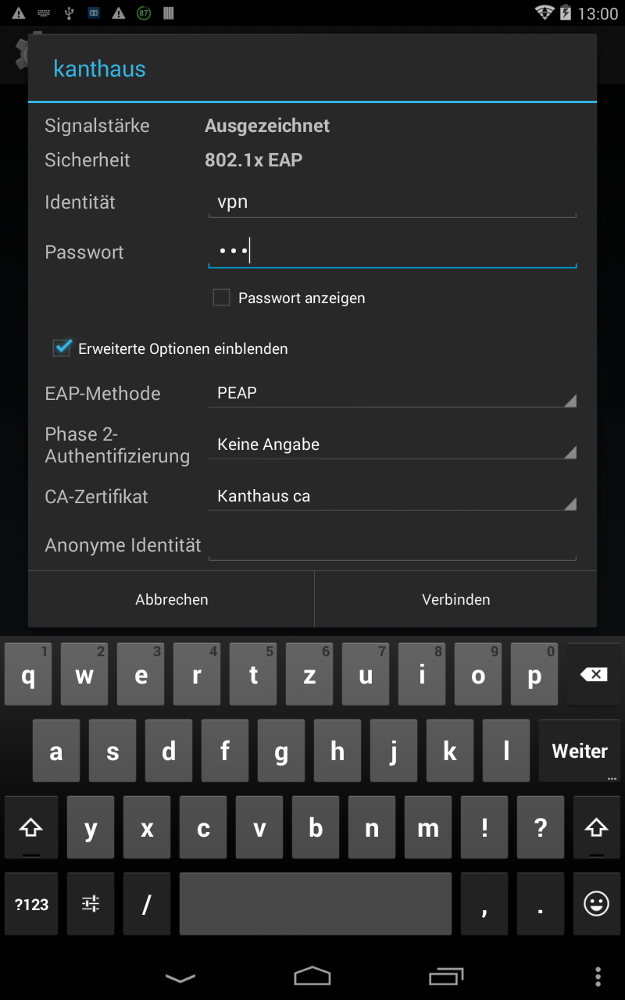

Das Kanthaus stellt mehrere Wlan-Verbindungen zur Verfügung.

Bitte nutze das Wlan nicht für illegale Dinge. Unsere Gast-Zugänge sind in der Geschwindigkeit begrenzt: Denke an deine Mitmenschen und schau dir nur die Katzenvideos an, die dich wirklich interessieren :-)

### Einfach nur schnell ins Netz

Netzwerkname/SSID: `kanthaus-gast`
Passwort: `dragonlove`

Dieses Netzwerk bietet dir ungefähr 8 Mbit/s Down- und 2 Mbit/s Upload. Dein Datenverkehr wird über einen niederländischen VPN Anbieter geleitet. Bitte achte darauf, deinen Datenverkehr selbst angemessen zu verschlüsseln bzw. dieses Netzwerk nicht als sicher zu betrachten.

###  Sicherer, schneller, was drucken, zocken...

Für alle anderen Netzwerkverbindungen nutzen wir WPA Enterprise mit dem Netzwerk "kanthaus". Das Einrichten dieser Verbindung ist auf allen Geräten ein bisschen anders. Vorweg erstmal ein paar technische Infos, Anleitungen dann weiter unten:

Methode: EAP-PEAP oder EAP-TTLS-MSCHAPv2 oder EAP-TTLS-GTC

CA-Zertifikat: [als PEM z.B. für Linux, Android](kanthaus_ca.pem) oder [als PKCS12 ohne Passwort](kanthaus_ca.p12)

Bitte beachte, dass du die CA-Zertifikatsüberprüfung unbedingt aktivierst, damit sichergestellt ist, dass du wirklich mit dem Kanthaus Netzwerk verbunden bist.

* Gäste-Netzwerk mit Drucker, 50 Mbit/s / 15 Mbit/s: Benutzername: `guest` Passwort: lass es dir im Kanthaus geben
* Vollzugriff aufs Kanthaus-Netzwerk, 250 Mbit/s / 40 Mbit/s: Benutzername `intern` Passwort: lass es dir im Kanthaus geben
* Vollzugriff aufs Kanthaus-Netzwerk für Bewohnis: Benutzername `resident` Passwort: lass es dir im Kanthaus geben
* VPN-Netz wie `kanthaus-gast`, 8 Mbit/s / 2 Mbit/s: Benutzername: `vpn` Passwort: `vpn`

Das VPN- und Gastnetzwerk ermöglichen es dir jeweils nicht, auf andere Computer im Netzwerk zuzugreifen. Möchtest du z.B. über die Windows-Dateifreigabe Dateien mit anderen tauschen oder im Netzwerk Spiele mit anderen spielen, verwende bitte die internen Netzwerke.

Der Drucker wird in allen entsprechenden Netzwerken automatisch gefunden. Unter Windows musst du noch den entsprechenden Treiber aus dem Internet herunterladen und installieren: [Xerox Phaser 6510 Windows Treiber](https://www.support.xerox.com/support/phaser-6510/downloads/enus.html?operatingSystem=win7&fileLanguage=de). Unter den meisten Linuxen taucht er einfach im "Drucken" Menü auf (sofern du avahi bzw. alternative MDNS Dienste aktiviert hast).

### Installationshinweis: Linux / Networkmanager
 
Wähle das Netzwerk "kanthaus" aus und klicke auf Verbinden
 
Wähle Getunneltes TLS (TTLS) als Legitimierungsmethode aus, wähle den Pfad zum vorher heruntergeladenen [CA Zertifikat](kanthaus_ca.pem) aus, gebe MSCHAPv2 als innere Legitimierung an und gebe den entsprechenden Benutzernamen und das Passwort (siehe oben, `guest`, `intern`, `resident`, oder `vpn`) ein. Klicke auf "Verbinden".

### Installationshinweis: Android 8
Lade das [CA Zertifikat als PEM herunter](kanthaus_ca.pem) und speichere es irgendwo auf deinem Telefon.
In deinem Einstellungsmenü unter Sicherheit & Privatsphäre findest du unten Verschlüsselung und Zugangsdaten und dann "Von SD Karte installieren". Wähle die heruntergeladene Datei aus.
Eventuell wirst du aufgefordert, deinen Entsperrcode einzugeben oder einen anzulegen. Du kannst diesen später wieder entfernen.

 
Du wirst nach einem Namen und dem Verwendungszweck des Zertifikats gefragt. Wähle etwas wie `Kanthaus` und wähle Wi-Fi/Wlan als Verwendungszweck aus.

Nun kannst du in deinem WLAN Menü nach Wlans suchen und dich mit `kanthaus` verbinden. Wähle das soeben eingerichtete CA Zertifikat aus und gebe deine Zugangsdaten ein.
 

Nach Klick auf Verbinden bist du im Wlan.

### Installationshinweis: Android 4.4
Lade das [CA Zertifikat als PEM herunter](kanthaus_ca.pem) und speichere es irgendwo auf deinem Telefon.
Gehe in dein Einstellungsmenü unter Sicherheit und wähle im Anmeldedatenspeicher `Von interner Speicherplatz installieren` o.Ä.
 
Wähle daraufhin die heruntergeladene `kanthaus_ca.pem` Datei aus. Du findest sie vermutlich unter Downloads o.Ä..
 
Daraufhin wirst du nach einem Namen und der Verwendung des Zertifikats gefragt: Vergebe einen Namen deiner Wahl, wie `Kanthaus`, und wähle aus, dass das Zertifikat für WLAN genutzt werden soll.
Unter Umständen fordert dich dein Telefon nun auf, eine Pin oder ein Displaysperrmuster festzulegen. Leider musst du diesem nachkommen :-(
 
Wähle anschließend in deinem Wlan-Menü aus, dass du eine Verbindung mit `kanthaus` herstellen möchtest. Blende die Erweiterten Optionen ein, wähle das CA-Zertifikat aus und gebe den Benutzernamen und das Passwort (siehe oben) ein. Mit Klick auf verbinden landest du im Wlan.
Wenn du möchtest, kannst du nun die Pin oder das Displaysperrmuster wieder entfernen, das CA Zertifikat bleibt trotzdem gespeichert.
