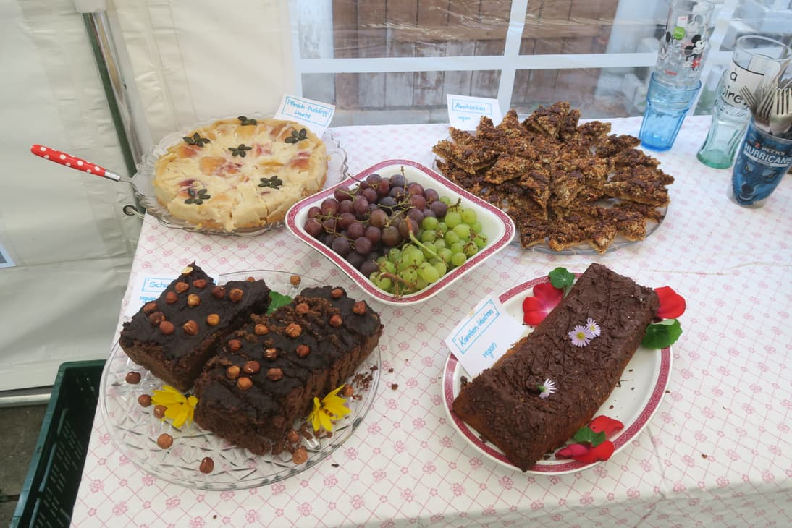
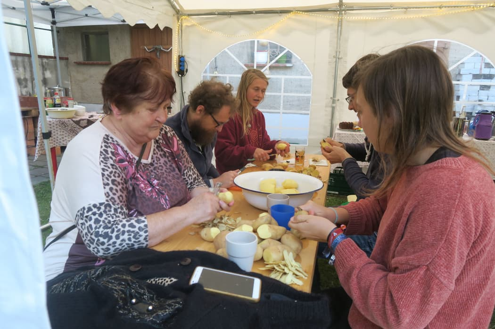
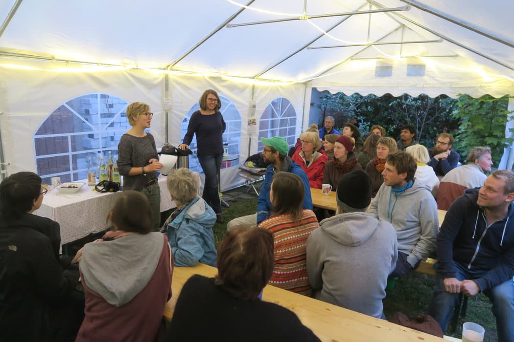
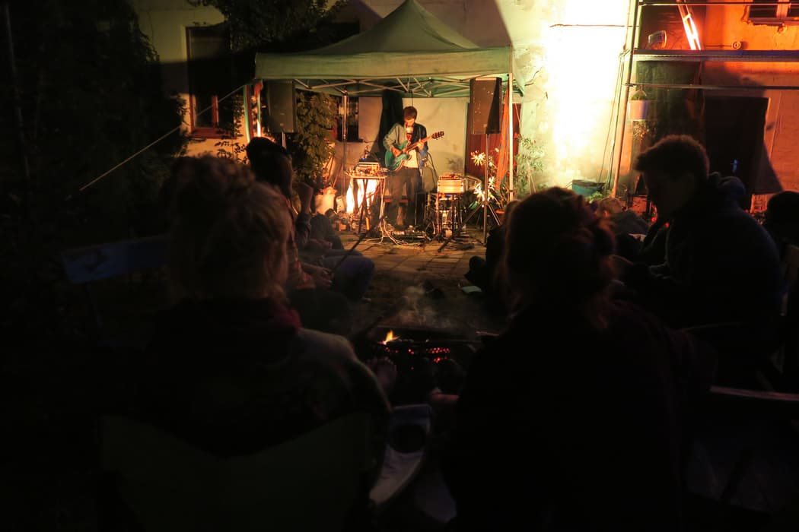
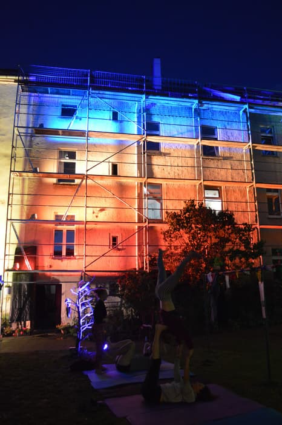

Autumn is approaching and already paints the leaves... the change of seasons is evident. Shorty after the calendar showed the beginning of autumn Kanthaus held its [(late) summer festival](/events/2019-09-28_sommerfest) on September 28.

===

One after the other interested Wurzeners arrived in the afternoon. They were happy to see the houses from the inside during a house tour. Some still knew the rooms from decades ago, others were intrigued to find out more about our way of communal living. Regulars from the [Open Tuesday](/events/opentuesday), neighbors, friends from Wurzen and Leipzig and even some new faces found their way into the carefully decorated yard and to the vegan cake buffet.

While around half of the guests participated in the house tours led by Nathalie and Janina, the others were busy cutting potatoes, leek, carrots, parsnips, onions, peppers, mushrooms and much more. Thanks to a carload full of veggies we got from the [Grimma Tafel](https://landesverband-saechsische-tafeln.de/grimma/standorte-ausgabestellen/ausgabestelle-grimma/) the communal cutting party was a big success and provided the necessary ingredients for two tasty dishes. Lise and Thore took on the task of transforming all the nicely cut vegetables into amazing food, making perfect use of the outdoor kitchen thhttps://aktion.bund.net/das-klima-kipptat was specifically built for this occasion.

In the meantime Kanthausians presented their projects: Starting with various areas within [foodsharing](../2018-09-26_foodsharing), the [MOVE Utopia](https://move-utopia.de/), the [Auerworld Festival](https://auerworld-festival.de/) and [Gerechte 1 Komma 5](http://gerechte1komma5.de/) up to the local Wurzen group of [BUND](https://www.bund.net/), the presentations showed the diversity of projects Kanthaus houses.

As soon as it was dark we started fire in our fire bowls and Silvan's installations dipped Kanthaus in magical light. The evening started with live music by [Oh No Noh](https://www.youtube.com/watch?v=TbVI2NLVS9M) whose experimental sound lead the listeners into dreamy spheres. While some immersed themselves in the music, others enjoyed cake on a stick that was prepared directly over the fire.

We're happy about everybody who showed up, and especially that different generations came together. It was a great opportunity to talk to Wurzeners about the city, our projects and communal living. Once again it became obvious that many people are curious about Kanthaus and that prejudice is most easily countered by being open and letting people in. Coming together for cooking, eating and talking in a relaxed atmosphere makes it easy to get to know each other. For us the summer festival definitely was a success and we are grateful to all the people who made it possible. That is not only us Kanthausians but also the Grimma Tafel and the [Sächsische Mitmach-Fonds](https://www.mitmachfonds-sachsen.de/) that supported the event financially.

 
_Supported by tax money based on the budget decided by the representatives on the Saxon parliament._

