In 2019 many things happened in and around Kanthaus. In the first week of January 2020 we took the time to go through last year's [CoMe minutes](/governance/minutes), chat logs and photos to compile a short review. Here's what we got:

## 2019 in numbers

_(2018 for comparison)_

- 208 unique people _(252)_
- 3798 nights spent _(3652)_
- 18.26 nights per person _(14.49)_
- 10.41 people per day _(10.01)_
- 44 evaluations _(61)_
- 13.12 kwh electricity per day _(6.00)_
- 53 liters water per day _(47 liters)_
- 970 m³ gas _(1318 m³)_

general topics:
stuff stuff stuff --- funding --- gas-discussion over two month -- bike projects --- rooms rearranging

- 15 Kanthausians (+2)
    - 11 Members (+5)

---

### Slack messages

5200 slack messages in 11 channels -> 11.5 messages per day (2018: 4200 messages)

---

## January
- association meetings
- chandi became member
- lise became member
- winter of karrot
- KMW welding for TÜV 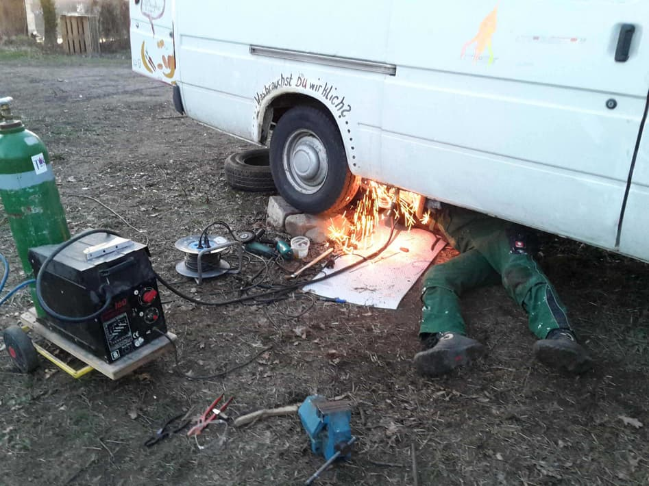
- utopival meeting
- month of calm starts!
- beginning of dinner lottery
- basement storage moved from K22 to K20, triggered start of Wupp Hours
- talks about project pressure and gender roles
- Bodhi's and Tais' backstory
- birth of uavcan-web a.k.a kanthaus-server web interface 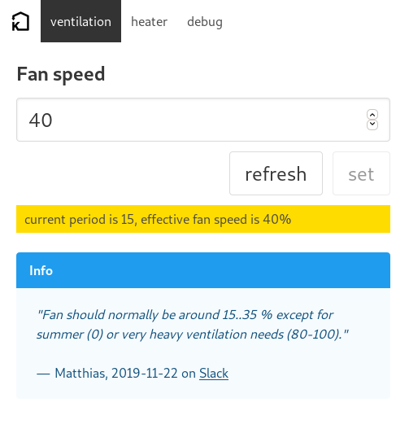
- 3d printer and cnc mill arrived

---

## February
- snow! 
- clara and nick became volunteers
- foodsharing board meeting 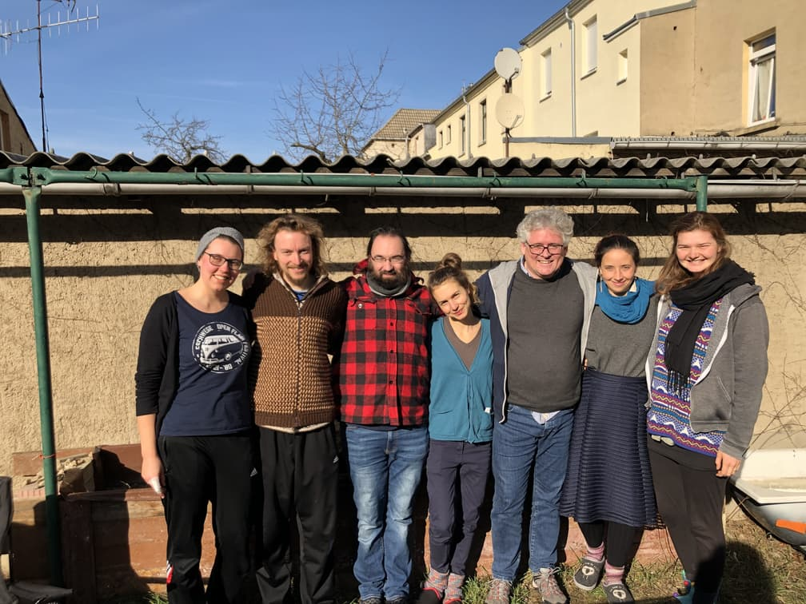
- foodsharing hackweek 
- we bought a scaffolding 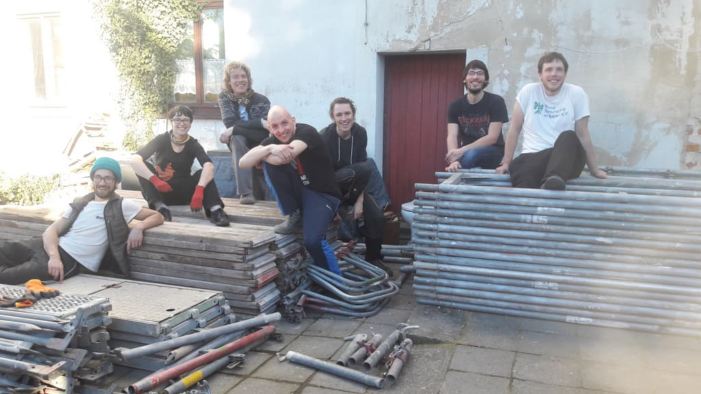
- luisa visited us and told us about Villa Locomuna money systems
- don't-ocracy session
- money proposals session
- WIFI access in K22
- play fight session
- findus cat painting in sleep kitchen

---

## March
- roof tile pickup 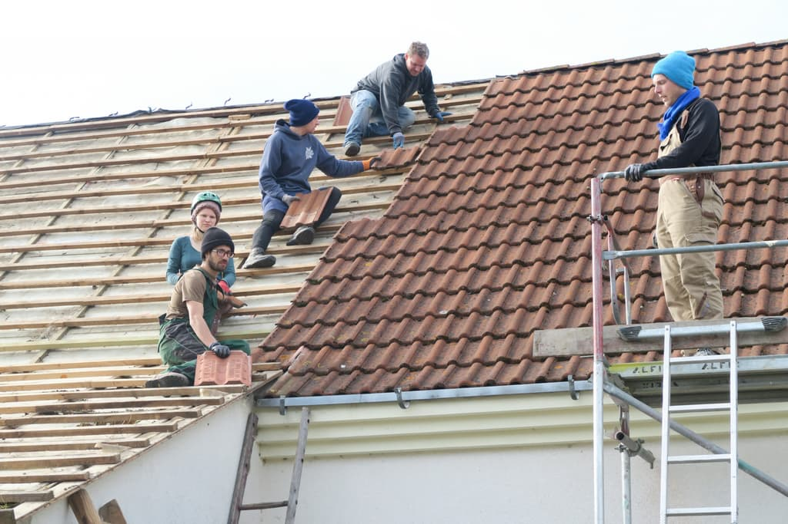
- foodsharing-auf-festivals vorbereitungstreffen
- BUND müllsammelaktion 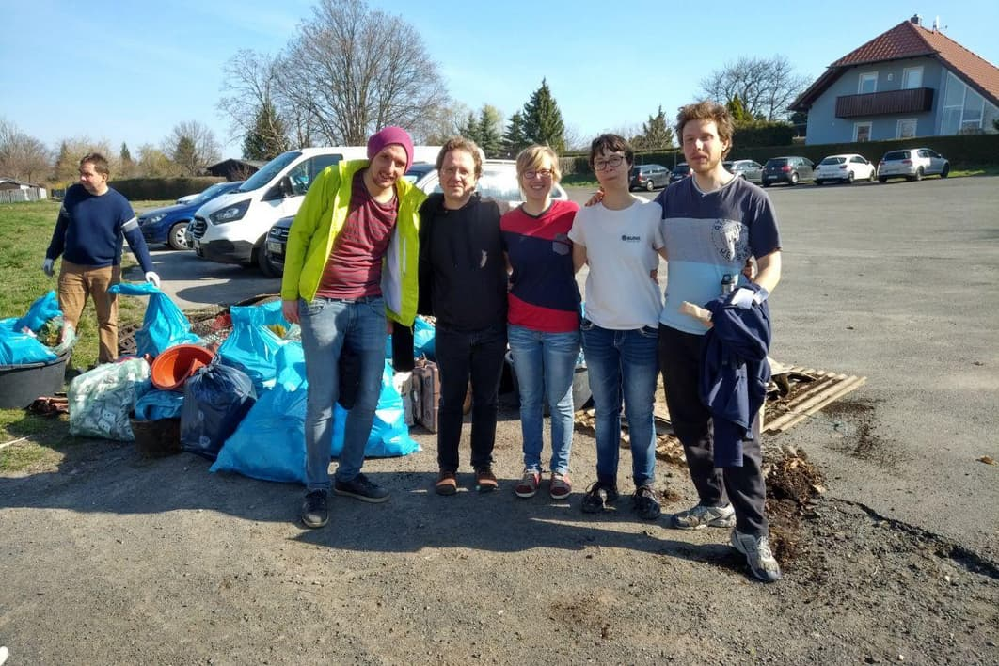
- foodsharing t-shirt printing 
- preparing for roof renovations 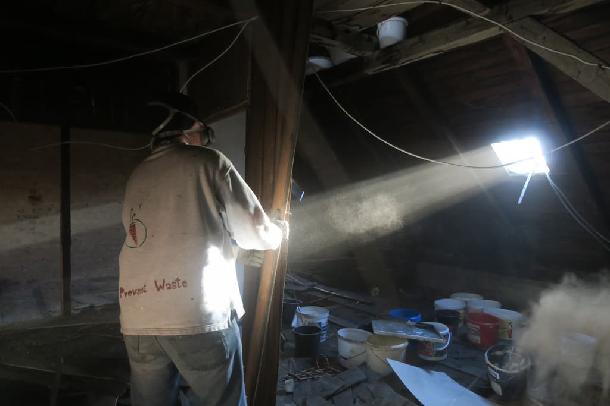
- undjetzt-meeting
- kitchen drying rack
- start of food rationing system
- free shop progress
- compost toilet prototype

---

## April
- open tuesday opening [video](https://cloud.kanthaus.online/s/DLyPTeY742Lj69E)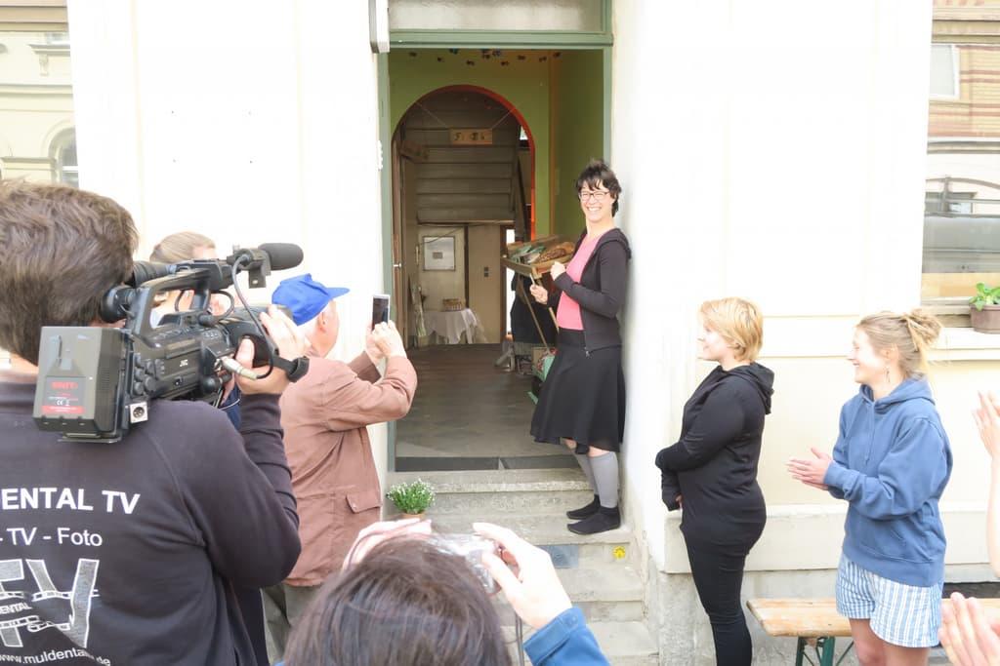
- more rainwater collection!
- bufdi start
- jar norm
- more stuff from annik's place
- new hammer drill bought

---

## May
- new logo   
- foodsharing extended board meeting
- move planning meeting
- mdr spot about foodsharing with nathalie [video](https://cloud.kanthaus.online/s/8LNLTsc7A7GtgaY)
- we got the apple tree 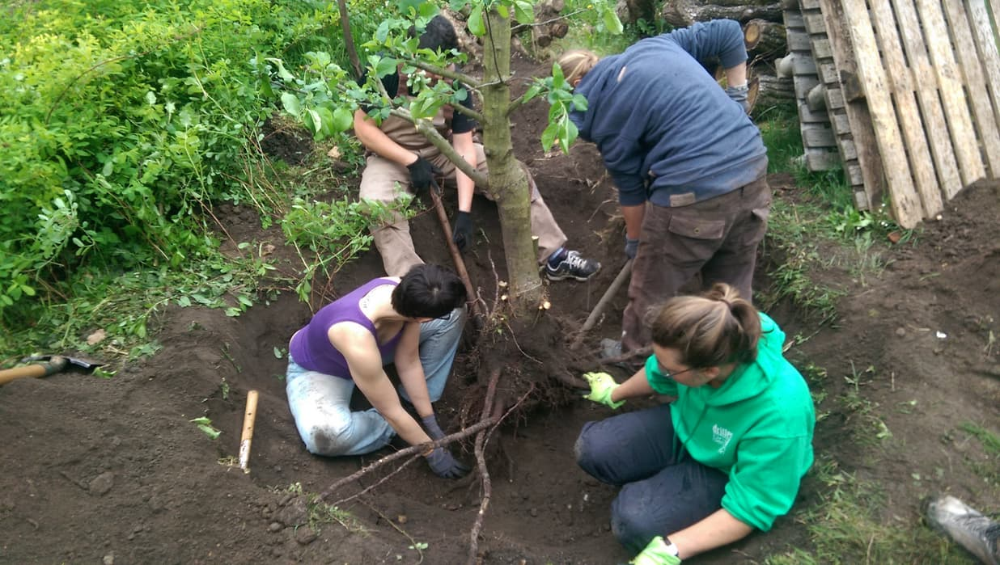
- the dumpster food dishwasher was installed
- ukuvote about the roof
- private shoe shelf 
- undjetzt and utopival meeting in almost empty kanthaus
- move building week in harzgerode
- foodsharing festival planning meeting

---

## June
- nathalie, thore and clara became members!
- ende gelände audio engineering meetup
- radio mephisto recorded clara for a report about kanthaus
- kaffeekränzchen #2 in kanthaus
- the fight against the moths started
- the high shelves were built in K22
- move planning meeting
- jati marriage   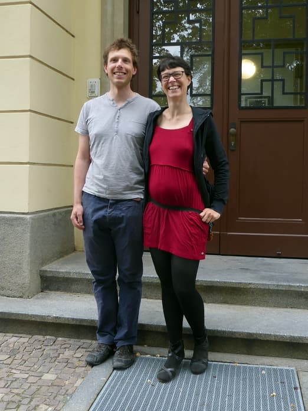

---

## July
- kanthaus mostly empty due to move and auerworld 
- inventaire + opendata week
- family room emerged
- lighting killed the house bus

---

## August
- lots of food and stuff arrived from auerworld, foodsharing festival and highfield 
- the highbed and elephant appeared in the elephant room    
- new wifi setup

---

## September
- hosting of FFF Wurzen meetings started
- many kanthausians participated in FFF Wurzen's die-in 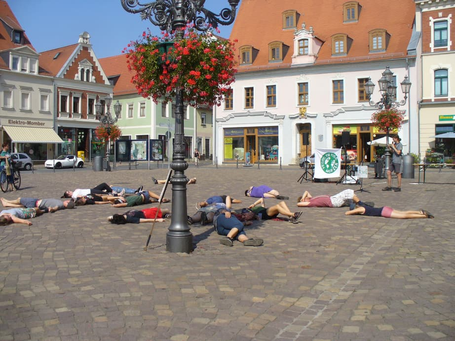
- almost all kanthausians went to climate strike in Leipzig
- A lot of building, deconstructing, rearranging, painting, fixing (hipster room, moomins, bitumen-roof, attic-wood, staircase, Möbelfundus...)
- tilmann put a lot of work in attic & hipster room
- the 1st ever MCM (mega/meta/master coordination meeting to plan a whole year) 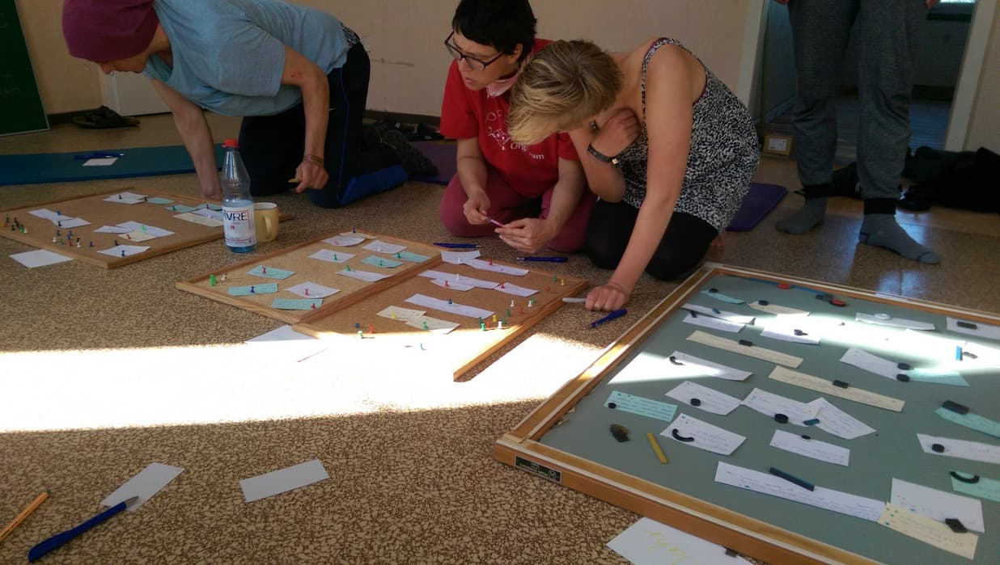
- Sommerfest: We celebrated our first Sommerfest with ~40 people, disco soup, live music, fire and fancy lights! :D 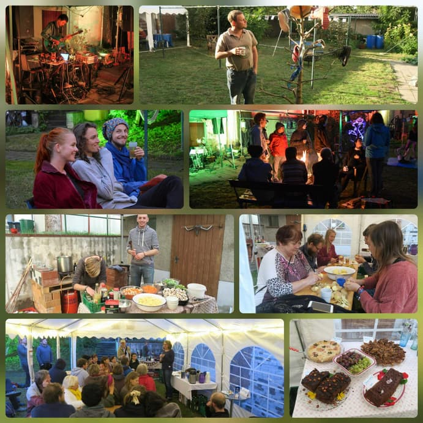
- Lise and Silvan saved a lot of food from the food bank in Grimma and established good contact to them

---

## October
- Nathalie reorganized the freeshop sorting room & later made a cafe out of it
- Cups were moved to the living room
- Silvan storage is emptied and renamed as baby bathroom!
- Mika arrived! 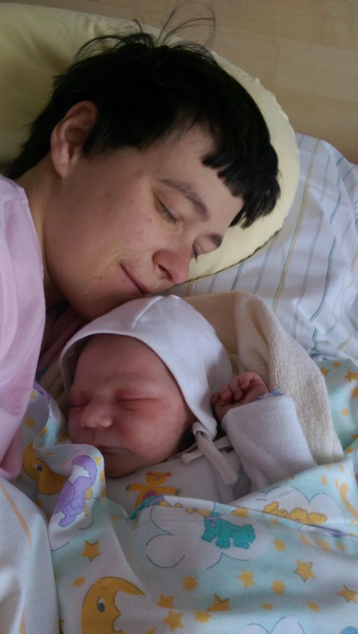
- money focused-sharing circle
- Schaukasten got destroyed
- Thore and Nathalie brought a Brotkorb!

---

## November
- heating started!
- scaffolding teardown [video](https://cloud.kanthaus.online/s/83ASPtS8rjf4EGx)
- implementing of knowledge sharing session by maxime
- We had the first ever sleeping arrangements plenum and it was very beneficial with so many people here
- while group was here we needed to find solutions for sleeping (private communal, bunk bed built)
- generally calm month related to topics, but quite a lot of groups & visitors

---

## December
- more partying-going out (bar night, villa klug evenings, kitchen parties) 
- lots of sorting (after tries from tilmann & doug, bodhi finishes the intermediate storage, winter section), improving (bike locks, soap holders) 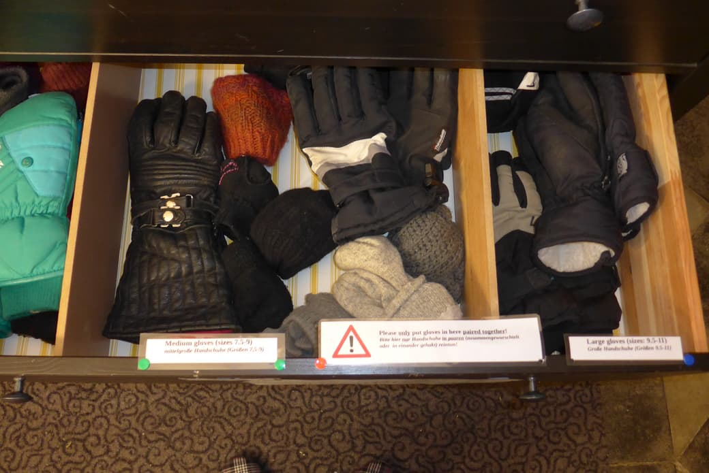 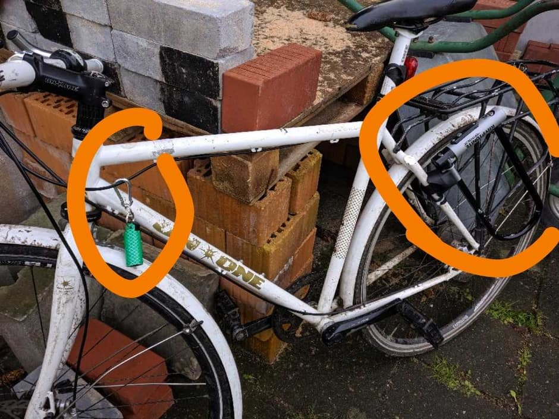 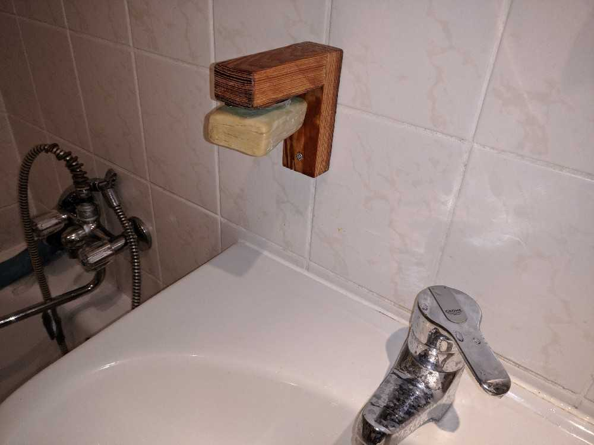
- got less and less people
- day of light with great outcome
- LAN-Christmas 
)
- New Year's Eve 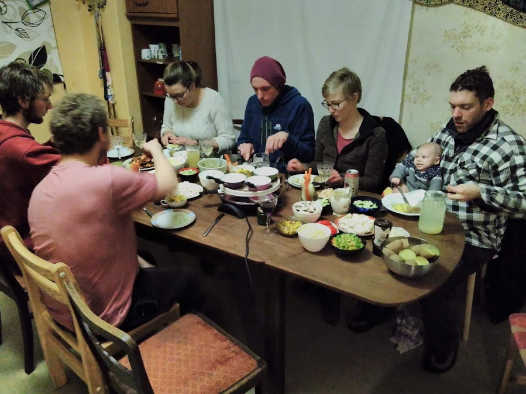
