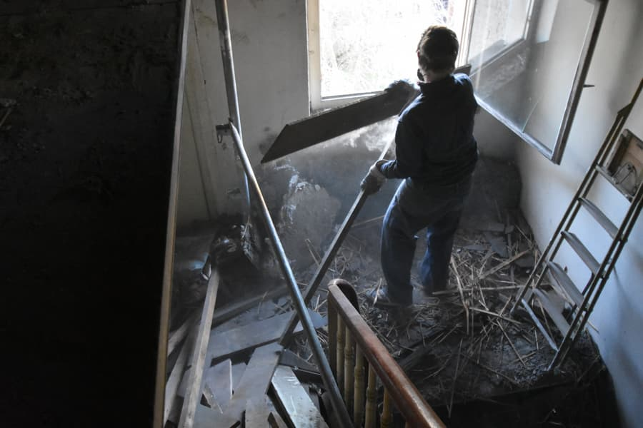
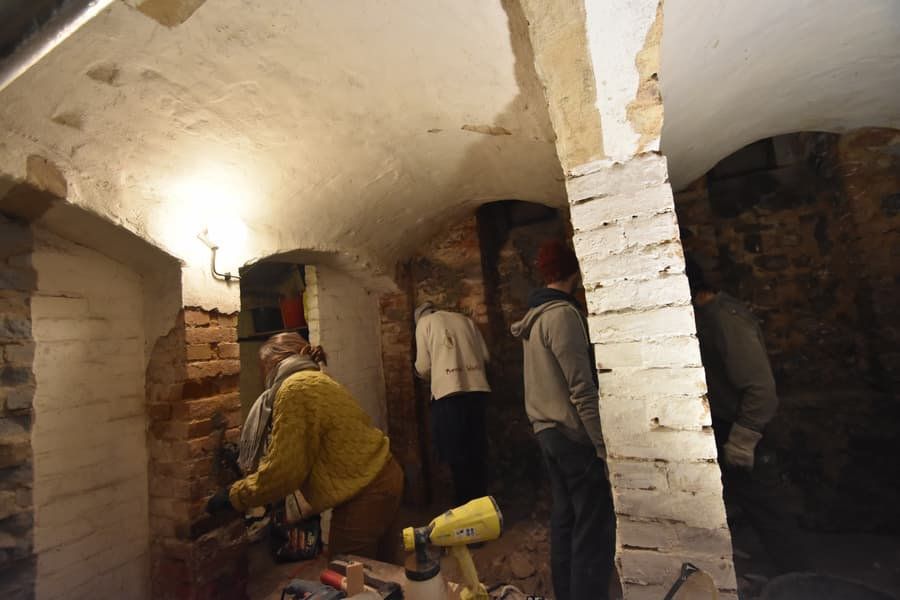
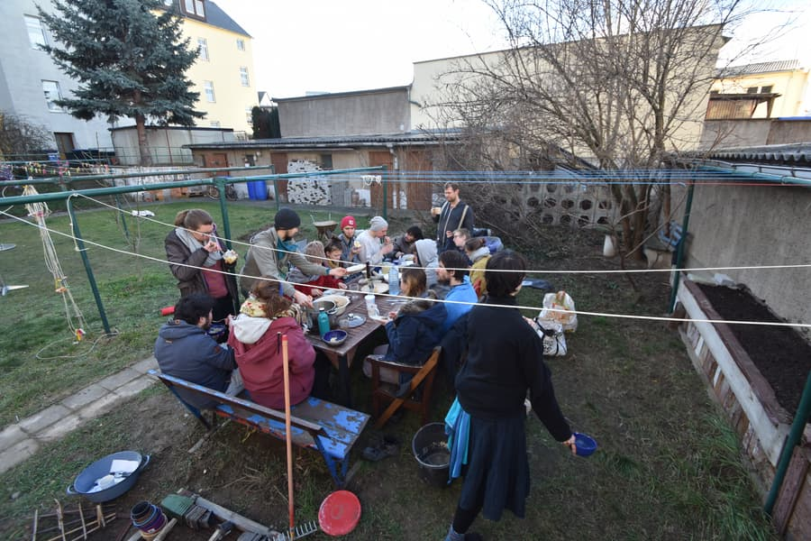
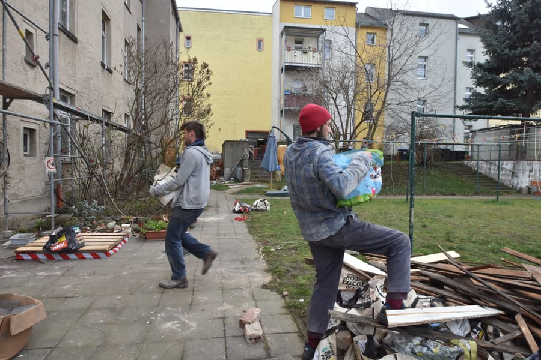

Die Menschen aus dem Kanthaus möchten allen Teilis der [Wuppwoche](/events/2020-01-12_wuppweek) ein großes Dankeschön aussprechen! Wir haben Riesenfortschritte gemacht und freuen uns darauf dieses Jahr noch die Dächer fertig zu kriegen. Möge dies der letzte Winter mit Detektivarbeit über Tropfverläufe und nächtliche Wasserfälle im Treppenhaus der 22 gewesen sein!

===

Gemeinsam haben wir einen kompletten Raum eingerissen, einen ganzen Haufen Holz entfernt und eine Menge Spaß auf unseren Abrissstellen gehabt. Wir haben Unmengen an Bauschutt produziert und auch schon eine beachtliche Menge davon zum Recyclinghof gebracht.

Unser Stromverbrauch hat einen Höchststand erreicht, schließlich wurde soviel geduscht wie nie. Und vielleicht gab es auch soviele dreckige Menschen im Haus wie nie.

Aber ihr habt uns nicht bloß bei Zerstörung geholfen! Dank Anjas Initiative wurde der Garten vorbereitet und sieht nun aus als könnte der Sommer jeden Tag losgehen. Ein neuer Kompost wurde angelegt und wir hoffen, dass dieser dann auch ohne Fliegen-Schutz-Maske benutzt werden kann. Das BASSment öffnete am Sonntag nach einer Woche voller Verputzarbeiten und diverser kleiner Arbeitsparties dann offiziell als Club seine Pforten und lieferte einen grandiosen Abschluss.

Wir haben zusammen gearbeitet, uns dreckig gemacht, uns im Staub gewälzt, getanzt, tolles Essen gegessen, die Villa Klug zum Barabend besucht, um ein Langerfeuer herum gesessen, mindestens eine Runde Werwolf gespielt, tausende Pennytüten voller Bauschutt bewegt, die Sonne auf der anderen Straßenseite genossen, super Mittagessen im Garten verspeist, Muskelkater gekriegt und nur eine einzige Person ist in einen Nagel getreten. Und die hat sich dabei nicht einmal verletzt!

Wir haben uns über alle gefreut, die dabei waren, die das Kanthaus in dieser Woche belebt und mit ihrer Energie und Motivation die Wuppwoche zu einem so tollen Erlebnis haben werden lassen. Es war ein Event, das wir definitiv wiederholen und, basierend auf dem Feedback das wir von den Teilis bekommen haben, verbessern wollen.

Es gibt immer noch was zu tun, also seid bereit für die nächste Wuppwochen-Einladung - sie kommt schneller als ihr denkt!
