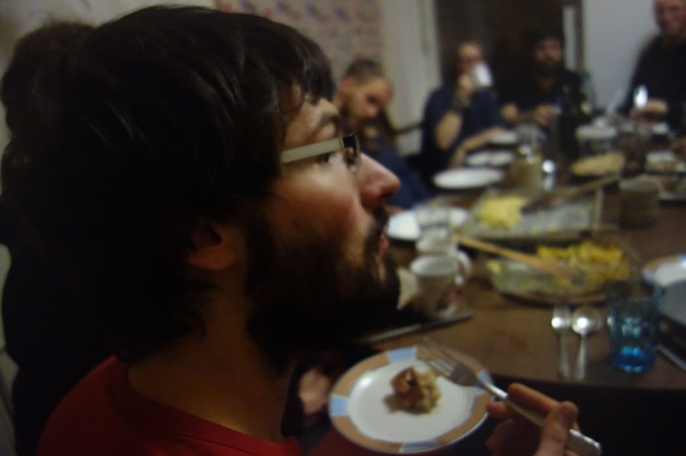

Ein Aspekt am Kanthaus-Leben, der mir inzwischen so natürlich vorkommt, dass ich ihn teilweise zu erwähnen vergesse, ist das funktionale Wohnen. Das bedeutet, dass Räume nach Funktionen und nicht nach Personen aufgeteilt werden. Es gibt also Räume zum Schlafen, zum Arbeiten, zum Werkeln, zum Musizieren, zum Essen, zum Kochen, zum Waschen, zum sich zurück ziehen und und und - aber eben nicht Räume, die permanent einzelnen Leuten gehören.

Im Kanthaus benutzen also ponteziell alle alle Räume, weil jeder Raum ein Gemeinschaftsraum ist. Dieses Konzept bietet tolle Möglichkeiten, kommt aber natürlich auch mit einigen Herausforderungen...

===

Reden wir zuerst über die Vorteile: Wenn nicht jeder Mensch einen eigenen Raum hat, kann man die verfügbaren Räume effizienter nutzen. Anstatt 15 Mal einen Raum mit einem Bett und einem Schreibtisch darin zu haben, gibt es zwei Gemeinschaftsschlafräume, zwei Büros und eine Handvoll Rückzugsräume, die je nach Bedürfnis reserviert werden können. So hat man mehr Platz für andere dedizierte Räume, wie zwei Werkstätten, einen Yoga-Raum, Seminarräume und mehr ([Hier](https://kanthaus.gitlab.io/expfloorer) kommt ihr zu Doug's schönem interaktiven Raumplan). Außerdem laufen sich dadurch alle notwendigerweise sehr häufig über den Weg, und man bekommt mit, was bei den Anderen so los ist - wie in einer großen Familie. Ein weiterer Vorteil ist, dass dadurch, dass alle Räume für alle sind, völlig klar ist, dass auch alle alles sauberhalten. Donnerstags steht bei uns immer gemeinsames Putzen an (die so genannte [Power Hour](/governance/collectiveagreements)), wo wir innerhalb von 1-2 Stunden in einer großen Aktion alle zusammen die gesamten zwei Häuser wieder auf Vordermann bringen.

 
_Viele Menschen im Esszimmer_

Für mich persönlich ist der größte Vorteil wirklich der, dass mich das funktionale Wohnen davon abhält mich irgendwo einzuigeln. Ich begegne zwangsläufig Menschen im Haus, jeden Tag, und zwar garnichtmal wenigen. Für mich ist das eine Bereicherung, denn ich bin nicht so gut darin Menschen aktiv aufzusuchen. Ich denke schnell, dass ich mich aufdränge oder unsichtbare Grenzen überschreite, deshalb ist dieses Raumkonzept, in dem die unsichtbaren Grenzen quasi aufgehoben sind, für mich wie gemacht. Für andere hingegen ist genau dieser Fakt das größte Problem.

Das häufigste Problem ist in der Tat, dass Menschen sich auch mal verstecken _wollen_. Und auch wenn das durchaus auch bei uns mal geht, sollte doch der Normalzustand die offene Gemeinschaft sein. Wenn sich jemand für mehrere Tage in einem Rückzugsraum verschanzt und nichtmal zu den gemeinsamen Mahlzeiten rauskommt, dann fühlt sich das für alle Beteiligten doof an. Einige fragen sich, ob sie der verkrochenen Person irgendwie zur Seite stehen sollten, wollen ihr aber auch nicht zu nahe treten; einige denken sich, dass sie vielleicht auch gern mal so lange abtauchen würden, es sich aber nicht trauen, und finden das dann unfair; und die Person im Raum kommt sich vermutlich merkwürdig eingesperrt vor und weiß vielleicht nicht, wie sie wieder an die Gemeinschaft anknüpfen soll. Wenn also Menschen wirklich mal alleine sein wollen, dann verlassen sie meist das Kanthaus und halten sich eine Zeitlang woanders auf.

Das ist aber nicht die einzige Herausforderung, die mit dem funktionalen Wohnen bei uns Einzug hielt. Ein anderes interessantes Problem ist, dass unsere Räume meistens ziemlich unpersönlich eingerichtet sind und das auf die Meisten ungemütlich wirkt. Erst vor kurzer Zeit wurde ein Raum liebevoll von Lise umgestaltet und promt wurde er zum neuen Lieblingszimmer von diversen Menschen.

 
_Der wahrscheinlich persönlichste Raum im ganzen Kanthaus_

Der persönliche Touch ist etwas, was unserer Einrichtung definitiv abgeht, und das ist nicht nur schade, weil damit die Räume kälter wirken, sondern auch, weil es Menschen darin limitiert sich über die Gestaltung ihrer Umgebung auszuleben. Die Zukunft dahingehend könnten [Raumpatenschaften](https://cloud.kanthaus.online/s/tQbZNsEqQJNSTmk) sein, die es Einzelnen gestatten Räume nach ihren Vorstellungen umzumodeln.

Es gibt noch viele weitere Aspekte am funktionalen Wohnen, die spannend sind. Zum Beispiel die Frage wie das mit den Dingen läuft: Wo darf was rumliegen, was gehört wem und wer ist wofür verantwortlich? Dazu kommt aber hoffentlich bald ein weiterer Post von Bodhi über 'Die Odysee des Krempels'. :)

Vielleicht noch ein abschließender Kommentar: Das was wir im Kanthaus machen ist nur eine Art, wie man funktionales Wohnen umsetzen kann - und auch bei uns verändern sich ständig die Gegebenheiten. Wir versuchen uns nicht von selbstgesetzten Regelwerken entmündigen zu lassen, flexibel auf Bedürfnisse eingehen zu können und gleichzeitig aber so offen und gemeinschaftlich zu bleiben, wie es nur geht. Das ist ein schwieriger Spagat, vor allem zwischen der Offenheit und Inklusion BesucherInnen gegenüber und der Festigung und Intimität innerhalb der Kerngruppe. Aber wir mögen ja Herausforderungen und bisher sind wir motiviert weiter an unseren Systemen zu feilen, damit unser funktionales Wohnen auch langfristig funktionieren kann.

Zum Weiterlesen über andere Varianten des funktionalen Wohnens seien die komplett offenen [Gießener FuWos](https://wiki.obscuro.cc/doku.php?id=funktionales_wohnen) oder auch geschlossene [WGs, die nur intern funktional sind](https://www.vice.com/de/article/wj9w7y/besuch-in-einer-funktionalen-wg), erwähnt.
