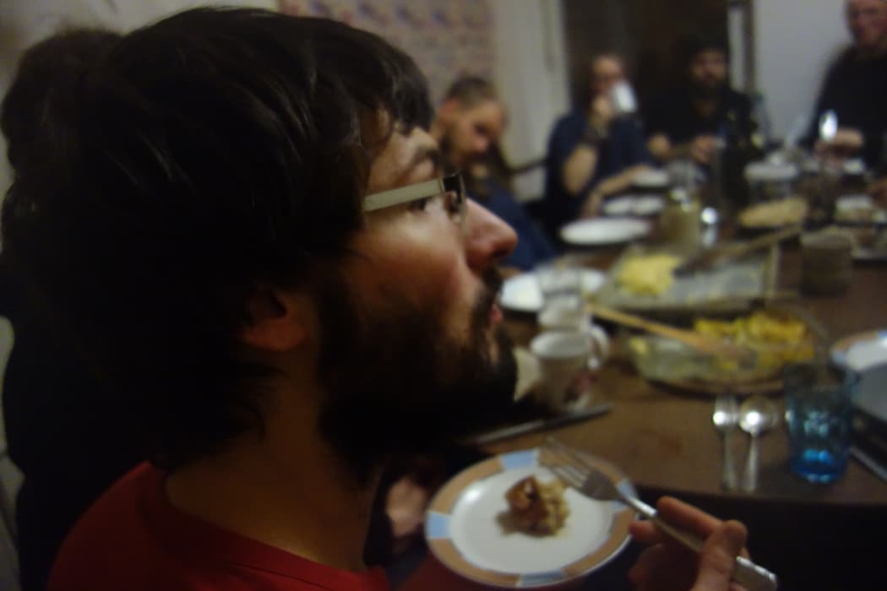
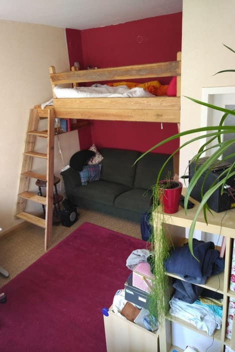

There is one aspect of Kanthaus life which is so natural to me that I sometimes forget to even mention it: Functional living. It means that rooms are attributed to purposes rather than people. There are rooms for sleeping, for office work, for building things, for making music, for eating, for cooking, for washing, for retreating and so on - but no rooms which are permanently occupied by individual people.

In Kanthaus every room is potentially used by everyone because every room is communal. This concept comes with great opportunities but also with some challenges...

===

Let's first talk about the opportunities: When not everyone has their private room the existing rooms can be used much more efficiently. Instead of having a room with a bed and a desk 15 times, we have two communal sleeping rooms, two offices, and a handful of retreat rooms that can be booked based on needs. This gives us more space for other dedicated rooms like two workshops, a yoga room, seminar rooms and more. ([Here](https://kanthaus.gitlab.io/expfloorer) you can visit Doug's nice interactive floor plan.) And you necessarily meet the other people in the house which leads to more contact and a sense of what's going on with the others - like in a big family. Another advantage of having all rooms communal is that it's totally clear that everyone is responsible for keeping everything clean. Every Thursday we have [Power Hour](/governance/collectiveagreements): 1 to 2 hours of communal cleaning to make the whole of Kanthaus look great again.

 
_Many people in the dining room_

For me personally the biggest advantage really is that it keeps me from holing up somewhere. I cannot not meet people in this house, every day, and not even just a few. For me this is an enrichment because I'm not very good at actively seeking out people by myself. I tend to quickly assume that I'm overstepping invisible boundaries. That's why this room concept - in which the invisible boundaries are basically eradicated - is perfect for me. For others this aspect is the biggest challenge.

The most common problem really is that sometimes people _want_ to hide. And even though to some extent this is also possible in Kanthaus, the default situation should be open community. If someone hides away in a retreat room for several days and doesn't even come out for communal meal times, it feels weird for everybody involved. Some people will ask themselves if they should somehow support the person in hiding but also fear to impose themselves on them; some will think that they'd also like to claim a room in that way sometimes but that they'd never dare to and thus perceive the situation as unfair; and the person in the room will probably feel unpleasantly caged and might not know how to reconnect to the community. So normally people who want to be alone leave Kanthaus and stay somewhere else for a while.

This of course is not the only challenge brought upon us due to functional living. Another interesting problem is that our rooms are usually quite lacking of a personal touch and most people find them not very cozy. Just a little while ago Lise furnished a room with love and care and all of a sudden it became the favorite room of many people.

 
_The probably coziest room in all of Kanthaus_

Personal touch is something that our interior design definitely misses. And this is not only a pity because it makes our rooms seem more cold, but also because it limits people in expressing themselves through shaping their surroundings. The future could hold roles such as [room godparents](https://cloud.kanthaus.online/s/tQbZNsEqQJNSTmk) which make it possible for individual people to change the looks and feel of a room based on their ideas.

There are many more fascinating aspects of functional living. For example the question of stuff: What is okay to be where? What belongs to whom? And who is responsible for what? Hopefully Bodhi will soon write a separate blog post about this 'odyssey of stuff'. :)

Maybe one last comment: What we do in Kanthaus is just one way to implement functional living - and we are also dynamically changing with the circumstances. We try not to be dogmatic about our self-imposed sets of rules and rather react flexibly to changing needs while at the same time protecting our open and communal way of living. This is a difficult balancing act especially between being open and inclusive towards visitors and working on stabilizing and deepening the bonds of the core group. But as you know we like challenges and so far we're still motivated to work on our structures to make our functional living future-proof.

More info about other forms of functional living (in German, sorry!) can be found in the wiki of the completely open [Gießen FuWos](https://wiki.obscuro.cc/doku.php?id=funktionales_wohnen) or in some press articles about [flat shares which are only functional internally](https://www.vice.com/de/article/wj9w7y/besuch-in-einer-funktionalen-wg).
