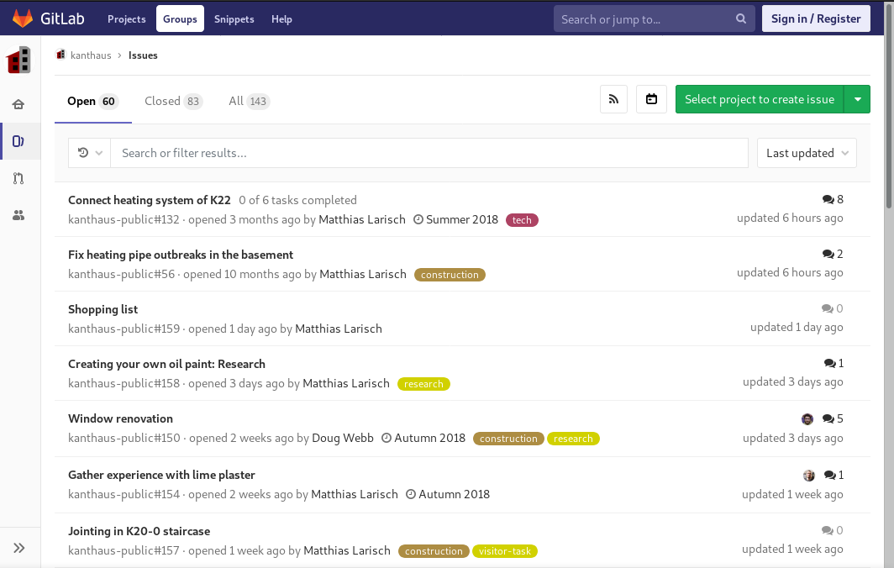

**Wir wollen die Häuser in Kantstraße 20 und 22 zu den Häusern unserer Träume machen!**  
Das heisst es ist noch viel zu tun...

===

### Was wollen wir?

Generell wollen wir einen Raum, an dem produktiv an Projekten gearbeitet werden kann, wir gleichzeitig aber auch alles finden, um tatsächlich dort zu _leben_, und zwar in einer schönen, heimeligen Gemeinschaft. Wir wollen Andere mit unserer Infrastruktur unterstützen, und wir wollen den Raum haben allein sein zu können. Wir wollen ein Layout, das ganz natürlich Bereiche entstehen lässt, die entweder der Arbeit, der Gemeinschaft oder dem Rückzug gewidmet sind. Wir wollen, dass das alles einfach erkennbar ist und für Neulinge wie für alt eingesessene Kanthausianer gleichermaßen funktioniert. Wir wollen, dass die physischen Strukturen unsere sozialen Strukturen unterstützen, und irgendwann wollen wir auch mal, dass alles ein bisschen hübsch aussieht.

All diese Träume zusammen zu bringen und Realität werden zu lassen ist keine leichte Aufgabe!

### Wie gehen wir das an?

[GitLab](https://handbook.kanthaus.online/gitlab.html) ist der Ort, an dem wir all die Dinge sammeln, die noch getan werden müssen. Es kann ein wenig überwätigend wirken, wenn man es das erste mal besucht, deshalb kommt hier eine kleine Einführung:

- Jede Aufgabe steht in einer _Issue_. Issues sind vergleichbar mit Threads in Foren und gut dafür geeignet alle relevante Information zu einer Aufgabe beisammen zu halten.
- Wer sich für eine Aufgabe verantwortlich fühlt wird sich zur zugehörigen Issue _assignen_ und damit ausdrücken, dass Motivation und Fähigkeiten vorhanden sind, um die Aufgabe anzugehen. Issues können mehrere assignte Menschen haben, die dann gemeinsam an der Lösung des Problems arbeiten.
- Issues können _Labels_ haben, die sie einfacher zu filtern machen. In unserem Fall gibt es Labels wie 'construction' und 'administrative', die die Art der nötigen Arbeit spezifizieren, 'remote' und 'deutsch', die anzeigen, ob man vor Ort sein oder Deutsch können muss, um bei einer Aufgabe zu helfen, und weitere.
- Issues können auch einem _Milestone_ angehören. Diese Kategorie nutzen wir für unsere [Roadmap Plannings](https://handbook.kanthaus.online/roadmap.html). 'Autumn 2018' ist also ein Milestone in GitLab-Logik. Issues die keiner Roadmap bzw. keinem Milestone zugeordnet sind haben oftmals kein klares Verfallsdatum.
- In der Suchleiste der Issue-Liste kann nach Labels, Milestones, Assignees und - natürlich - Text gesucht werden, um die für dich interessanten Aufgaben heraus zu _filtern_.
- Neben der Suchleiste kann die _Sortierung_ der Issues angepasst werden. 'Last updated' zeigt die Issues zuerst, in denen zuletzt etwas passiert ist.
- Sobald eine Aufgabe erfüllt wurde oder obsolet ist, wird die dazugehörige Issue _geclosed_. Issues werden niemals gelöscht, sondern immer nur geschlossen.

_Dies ist die Liste mit allen Issues_

Im Bild oben kannst du alle gerade beschriebenen Elemente finden:
- Oben steht, dass es gerade 60 offene, 83 geschlossene und insgesamt 143 Issues gibt.
- Darunter findest du die Suchleiste, mit dem Drop-Down-Menü zur Einstellung der Sortierungsoption daneben.
- Dann folgt die Liste aller Issues.
- Die erste Zeile innerhalb eines Issues zeigt dessen Titel und manchmal einen Kurzüberblick der Unteraufgaben.
- Die zweite Zeile beginnt mit der Nummer der Issue, gefolgt von der Zeit der Erstellung und dem Namen des Erstellers.
- Die Labels sind die bunten Sticker am Ende der zweiten Zeile.
- Auf der rechten Seite steht oben wieviele Nachrichten in der Issue stehen, und wer ihr Assignee ist, falls es einen gibt.
- Darunter steht, wann in der Issue zuletzt etwas passiert ist.

<a class="button" href="https://gitlab.com/kanthaus/kanthaus-public/issues">Besuch die Issue-Liste</a>

